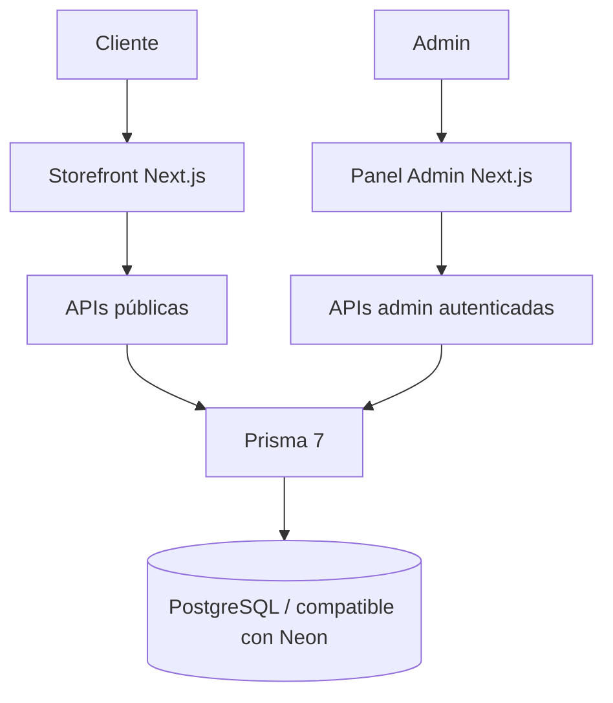

# L'Mere Studio — Simulador de Pedidos & CMS Multi-Tenant

[](CHANGELOG.md)
[](https://nextjs.org/)
[](https://react.dev/)
[](https://www.prisma.io/)
[](LICENSE)

[English](README.md) | [Português](README.pt-BR.md) | [日本語](README.ja.md) | [Español](README.es.md)

L'Mere Studio es una aplicación white-label y multi-tenant para pastelerías artesanales y diseñadores de tartas. Combina un simulador público de pedidos en cinco pasos con un panel administrativo autenticado para pedidos, catálogo, agenda, marca y configuración del tenant.

> **Baseline de ingeniería del portfolio:** la documentación describe comportamiento implementado y cubierto por los gates reproducibles de calidad indicados abajo. La promoción a la rama por defecto sigue siendo una decisión de revisión manual.

## Problema → solución

Los pedidos personalizados requieren coordinar disponibilidad, catálogo configurable, precios y comunicación con el cliente. L'Mere centraliza esas reglas manteniendo precio, disponibilidad y persistencia críticos bajo autoridad del servidor.

El caso técnico demuestra aislamiento multi-tenant, pricing server-side, sesiones admin HMAC, ownership, PostgreSQL con migraciones versionadas, fixtures deterministas Tenant A/B y cobertura de regresión con Playwright.

## Media de demostración reproducible

La documentación ya no depende de videos pregrabados, cursor falso, narración, subtítulos, música ni postproducción con ffmpeg. Las capturas se generan con datos PostgreSQL sintéticos mediante un comando Playwright separado de los tests E2E:

```bash
npm run demo:capture
```

Consulta [`docs/MEDIA.md`](docs/MEDIA.md) para el bootstrap limpio, requisitos y salidas en `docs/media/generated/`.

Los tests de comportamiento siguen separados:

```bash
npm run test:e2e
```

## Funciones principales

### Simulador público (`/[slug]`)

1. Calendario basado en horario semanal, fechas bloqueadas y lead time del tenant.
2. Tamaños con porciones, peso, precio base y límite de rellenos.
3. Masas, rellenos, sabores especiales y extras activos.
4. Mensaje, observaciones e imagen de referencia opcional.
5. Finalización confirmada: el servidor vuelve a validar catálogo/fecha/capacidad, recalcula subtotal/depósito, persiste el pedido y solo entonces expone valores confirmados para WhatsApp.

### Admin autenticado (`/admin`)

- gestión de estados de pedidos;
- CRUD de tamaños, sabores/rellenos y extras;
- horario semanal y fechas bloqueadas;
- branding/contacto por tenant;
- configuración de depósito, capacidad y lead time;
- navegación responsive con regresiones de teclado/foco.

## Arquitectura



- Provider Prisma: **PostgreSQL**.
- Variable canónica: `POSTGRES_PRISMA_URL`.
- Adapter runtime: `@prisma/adapter-pg`.
- CI usa PostgreSQL 16 descartable y migraciones versionadas.
- Fixtures deterministas crean Tenant A y Tenant B.

## Seguridad

- Sesiones admin HMAC-SHA256 con expiración en cookie HttpOnly, `SameSite=Strict` y `Secure` en producción.
- `ADMIN_SESSION_SECRET` requiere al menos 32 bytes de material secreto único.
- APIs admin derivan el tenant de la sesión verificada y validan ownership.
- `/api/orders` no confía en subtotal, depósito, disponibilidad ni IDs enviados por el navegador.
- El servidor resuelve catálogo activo, calendario/capacidad y pricing dentro de transacciones PostgreSQL serializables con retry limitado.
- Login y pedidos públicos tienen rate limiting persistente.

## Stack

| Área | Tecnología |
| --- | --- |
| Framework | Next.js 16.3.0 App Router |
| UI | React 19.2.4, Tailwind CSS v4, Lucide React |
| Lenguaje | TypeScript 5 |
| Base de datos | PostgreSQL, Prisma 7.9.1, `@prisma/adapter-pg` |
| Password hashing | bcryptjs |
| Browser tests | Playwright |

## Instalación

Requisitos: Node.js **22+**, npm compatible y PostgreSQL/Neon.

```bash
git clone https://github.com/Gyliardson/lmere-studio.git
cd lmere-studio
npm ci
cp .env.example .env
npm run db:generate
npm run db:migrate
npm run db:seed   # opcional para desarrollo/demo
npm run dev
```

Configura `POSTGRES_PRISMA_URL` y reemplaza el placeholder de `ADMIN_SESSION_SECRET` por un secreto único. No versionar credenciales reales.

### Calidad

```bash
npm run quality
npm run test:e2e
```

Consulta [`docs/QUALITY.md`](docs/QUALITY.md) para el contrato completo de CI y [`docs/MEDIA.md`](docs/MEDIA.md) para capturas.

## Evidencia y limitaciones

Los gates del repositorio cubren lint, typecheck, build, dependency audit, secret scan del historial alcanzable, tests unitarios, migraciones sobre PostgreSQL vacío, aislamiento Tenant A/B, reglas negativas de pedidos, idempotencia/concurrencia, lifecycle de sesión, Playwright desktop/mobile y regresiones de teclado/foco/dialog/combobox con artifacts visuales deterministas inspeccionados manualmente.

Esto es cobertura orientada a riesgo, no certificación WCAG completa. La promoción a la rama por defecto es intencionalmente manual y sigue el checklist de [`docs/RELEASE.md`](docs/RELEASE.md); la protección/rulesets de branches es una configuración de gobernanza que se revalida en el release.

## Licencia

Software bajo **Licencia Propietaria (Todos los Derechos Reservados)**. Uso comercial, redistribución, hosting SaaS o copia de código requiere autorización explícita. Consulta [LICENSE](LICENSE).
