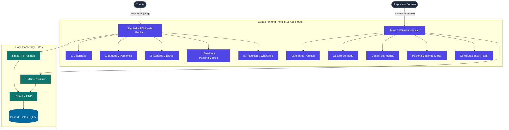

# L'Mere Studio - Simulador de Pedidos de Pasteles & CMS Multi-Tenant

[](CHANGELOG.md)
[](https://nextjs.org/)
[](https://react.dev/)
[](https://www.typescriptlang.org/)
[](https://www.prisma.io/)
[](https://tailwindcss.com/)
[](LICENSE)

[English](README.md) | [Português](README.pt-BR.md) | [日本語](README.ja.md) | [Español](README.es.md)

L'Mere Studio es una aplicación Web Multi-Tenant Marca Blanca diseñada para pastelerías artesanales, reposterías y diseñadores de pasteles. Proporciona un Simulador de Pedidos interactivo en 5 pasos para clientes y un Panel de Administración CMS autoservicio para los propietarios.

---

## Demostración

### Simulador Público de Pedidos (Flujo Móvil)
<video src="./assets/lmere-studio-mobile-demo.mp4" controls="controls" muted="muted" width="100%"></video>

### Panel de Administración CMS (Flujo de Escritorio)
<video src="./assets/lmere-studio-desktop-demo.mp4" controls="controls" muted="muted" width="100%"></video>

## Capturas de Pantalla

<details>
<summary>Haz clic para ver la Galería</summary>
<br>

**Flujo del Cliente (Móvil)**
| Calendario y Tienda | Tamaño y Porciones | Sabores y Detalles |
| :---: | :---: | :---: |
|  |  |  |

**Panel de Administración (Escritorio)**
| Kanban de Pedidos | Editor de Menú | Personalización de Marca |
| :---: | :---: | :---: |
|  |  |  |

</details>

---

## Funcionalidades Principales

### Simulador Público de Pedidos (`/[slug]`)
- **Paso 1: Calendario del Evento**: Selección interactiva de fecha con validación automática de días bloqueados y tiempo mínimo de anticipación.
- **Paso 2: Tamaño y Porciones**: Recomendación de peso y porciones (Mini, Pequeño, Mediano, Grande) con precio base.
- **Paso 3: Masas, Rellenos y Adicionales**: Selección modular de masa, rellenos (únicos o múltiples), recargos por sabores especiales y complementos opcionales (toppers, empaques).
- **Paso 4: Detalles de Personalización**: Mensaje para la placa del pastel, instrucciones especiales y enlace de foto de referencia.
- **Paso 5: Resumen y Finalización**: Desglose de precios en tiempo real, cálculo automático de depósito (50%, 100% o solo cotización), copia de clave PIX en 1 clic y envío directo a WhatsApp.

### Panel de Administración CMS (`/admin`)
- **Gestión de Pedidos**: Control de estado tipo Kanban (Pendiente, Confirmado, Completado, Cancelado).
- **Gestión del Menú**: CRUD completo para tamaños de pasteles, masas, rellenos, adicionales y precios.
- **Control de Agenda**: Bloqueo y desbloqueo de fechas específicas en el calendario.
- **Personalización de Marca**: Configuración visual en tiempo real de logos, banners, colores principales y temas de fondo.
- **Configuraciones (Feature Flags)**: Interruptores para subir fotos, opciones de entrega y modos de pago de depósito.

---

## Arquitectura del Sistema



---

## Tecnologías Utilizadas

| Dominio | Tecnología |
| --- | --- |
| Framework | Next.js 16 (App Router, Turbopack) |
| Interfaz y Estilos | React 19, Tailwind CSS v4, Diseño Glassmorphism |
| Iconos | Lucide React (Sin emojis en toda la app) |
| Base de Datos | Prisma 7 ORM con `@prisma/adapter-better-sqlite3` |
| Seguridad | Encriptación Bcrypt |
| Lenguaje | TypeScript 5 (Modo Estricto) |

---

## Instalación y Configuración

### Requisitos previos
- Node.js 20.x o superior
- npm 10.x o superior

### Pasos de Instalación

1. Clonar el repositorio:
   ```bash
   git clone https://github.com/usuario/lmere-studio.git
   cd lmere-studio
   ```

2. Instalar dependencias:
   ```bash
   npm install
   ```

3. Configurar variables de entorno:
   ```bash
   cp .env.example .env
   ```

4. Ejecutar la base de datos y el script de carga inicial:
   ```bash
   npx prisma db push --config=prisma.config.ts
   npm run db:seed
   ```

5. Iniciar el servidor de desarrollo:
   ```bash
   npm run dev
   ```

6. Abrir en el navegador:
   - **Simulador Público**: `http://localhost:3000/doce-arte`
   - **Panel de Admin**: `http://localhost:3000/admin` (Credenciales: Identificador: `doce-arte`, Contraseña: `admin123`)

---

## Licencia

Este software está protegido por una **Licencia Propietaria (Todos los Derechos Reservados)**. El uso comercial, redistribución o copia de código sin autorización previa está estrictamente prohibido. Consulte el archivo [LICENSE](LICENSE) para más información.
