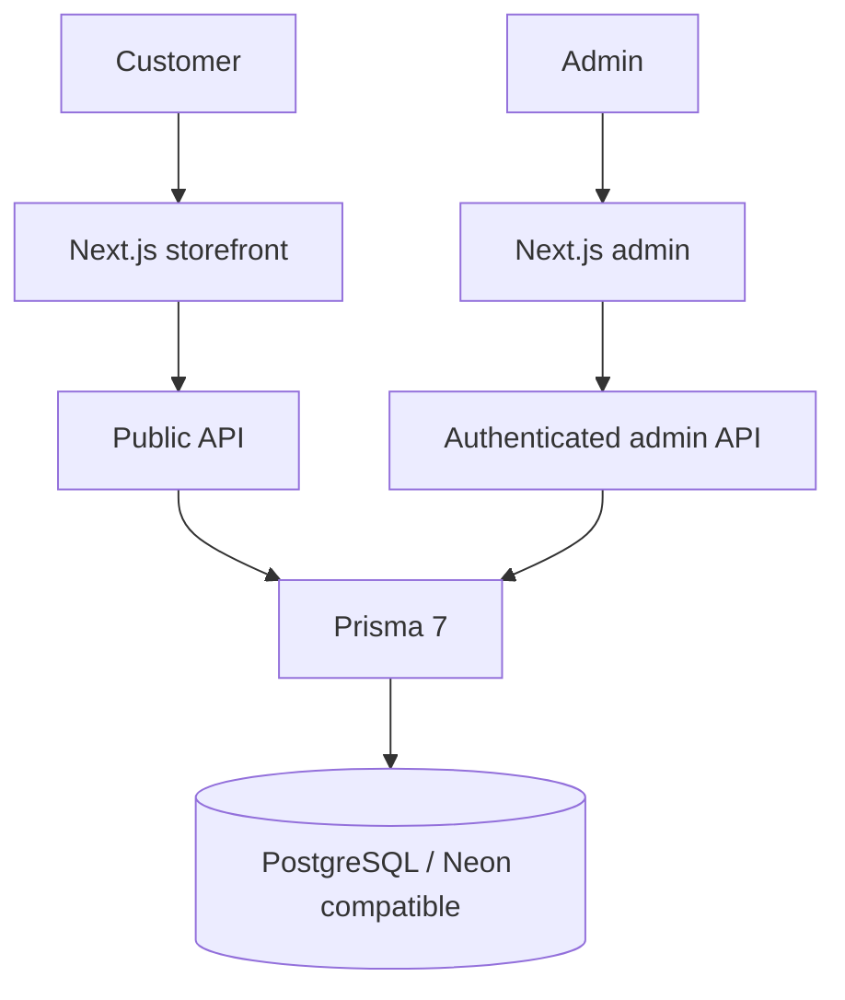

# L'Mere Studio — マルチテナント注文シミュレーター & CMS

[](CHANGELOG.md)
[](https://nextjs.org/)
[](https://react.dev/)
[](https://www.prisma.io/)
[](LICENSE)

[English](README.md) | [Português](README.pt-BR.md) | [日本語](README.ja.md) | [Español](README.es.md)

L'Mere Studio は、洋菓子店やケーキデザイナー向けのホワイトラベル型マルチテナント Web アプリケーションです。5 ステップの公開注文シミュレーターと、注文・商品・営業日・ブランド・テナント設定を管理する認証済み管理画面を提供します。

> **ポートフォリオ向けエンジニアリング基盤:** PR #27 により professionalization 作業はすでにデフォルトブランチ `master` へ昇格済みです。このリポジトリは下記の再現可能な品質 gate で検証されている実装済みの動作を記載し、今後の release は [`docs/RELEASE.md`](docs/RELEASE.md) に従う maintainer の手動判断です。

## 課題 → 解決策

カスタム注文では、空き状況、商品構成、価格ルール、顧客連絡を一貫して扱う必要があります。L'Mere はこれらをテナント単位で管理し、重要な価格・在庫/日程・永続化ルールはサーバー側を権威とします。

技術的な主題は以下です。

- テナントごとの商品・営業日・ブランド・管理データ分離
- サーバー側での価格/日程/容量再検証
- HMAC 署名付き管理セッションと ownership 検証
- PostgreSQL のバージョン管理 migration と決定的な 2 テナント fixture
- unit / integration / Playwright によるリスク重視の回帰テスト
- 再現可能な desktop/mobile ドキュメント画像生成

## 再現可能なデモメディア

README は、事前録画動画、疑似カーソル、ナレーション、字幕、BGM、ffmpeg 後処理には依存しません。ドキュメント用スクリーンショットは、合成 PostgreSQL fixture を使い、E2E とは別の Playwright コマンドで生成します。

```bash
npm run demo:capture
```

クリーンな準備手順、前提条件、`docs/media/generated/` の出力については [`docs/MEDIA.md`](docs/MEDIA.md) を参照してください。

通常の動作検証は別コマンドです。

```bash
npm run test:e2e
```

## 主な機能

### 公開注文シミュレーター (`/[slug]`)

1. テナントの週間営業日、休業日、最小 lead time に基づくカレンダー
2. 人数、重量、基本価格、フィリング上限を持つサイズ選択
3. 生地、フィリング、特別価格、追加オプション
4. メッセージ、備考、任意の参考画像
5. サーバー確認済み finalization: 商品/日付/容量を再検証し、subtotal/deposit を再計算、注文を保存してから WhatsApp handoff 用の確定値を返します

### 認証済み管理画面 (`/admin`)

- 注文ステータス管理
- サイズ・味/フィリング・追加商品の CRUD
- 週間営業日とブロック日管理
- テナントごとのブランド/連絡先設定
- deposit、capacity、lead time などの機能設定
- desktop/mobile のレスポンシブ操作とキーボード/フォーカス回帰テスト

## アーキテクチャ



- Prisma provider: **PostgreSQL**
- 接続変数: `POSTGRES_PRISMA_URL`
- runtime adapter: `@prisma/adapter-pg`
- 本番は Neon を利用可能、local/CI は通常の PostgreSQL TCP
- 空 DB は `prisma migrate deploy` の commit 済み migration で初期化
- CI は disposable PostgreSQL 16 と Tenant A/Tenant B fixture を使用

## セキュリティモデル

- 管理セッションは期限付き HMAC-SHA256、HttpOnly + `SameSite=Strict` cookie。本番は `Secure`。
- `ADMIN_SESSION_SECRET` は最低 32 bytes の一意な秘密情報が必要です。
- 管理 API は request の tenantId を信用せず、検証済みセッションから tenant を決定します。
- 既存リソース更新/削除では ownership を検証します。
- `/api/orders` は browser の subtotal、deposit、availability、関連 ID を権威として扱いません。
- サーバーは active catalog、日程/容量、価格を再評価し、serializable PostgreSQL transaction と限定 retry を使います。
- 公開 login/order には永続 rate limiting があります。

## 技術スタック

| 領域 | 技術 |
| --- | --- |
| Framework | Next.js 16.3.0 App Router |
| UI | React 19.2.4, Tailwind CSS v4, Lucide React |
| Language | TypeScript 5 |
| Database | PostgreSQL, Prisma 7.9.1, `@prisma/adapter-pg` |
| Password hashing | bcryptjs |
| Browser test | Playwright |

## セットアップ

前提: Node.js **22+**、対応 npm、PostgreSQL または Neon。

```bash
git clone https://github.com/Gyliardson/lmere-studio.git
cd lmere-studio
npm ci
cp .env.example .env
npm run db:generate
npm run db:migrate
# 任意の破壊的な合成 demo seed。local/disposable DB のみ:
LMERE_ALLOW_DEMO_SEED=true npm run db:seed
npm run dev
```

`POSTGRES_PRISMA_URL` を開発 DB に設定し、`ADMIN_SESSION_SECRET` の placeholder を一意な秘密情報に置き換えてください。実際の credential を commit しないでください。

`npm run db:seed` は本番 bootstrap ではありません。合成 `doce-arte` tenant を意図的に置き換える破壊的 demo seed であり、`NODE_ENV=production` では拒否され、`LMERE_ALLOW_DEMO_SEED=true` の明示 opt-in が必要です。本番 bootstrap は `npm run db:migrate` のみを使用します。

### 品質確認

```bash
npm run quality
npm run test:e2e
```

CI/PostgreSQL の詳細は [`docs/QUALITY.md`](docs/QUALITY.md)、メディア生成は [`docs/MEDIA.md`](docs/MEDIA.md) を参照してください。

## 品質証拠と制約

リポジトリの gate は lint、typecheck、build、dependency audit、到達可能な Git 履歴の secret scan、監査可能な SARIF を伴う CodeQL JavaScript/TypeScript、unit test、空 PostgreSQL migration、Tenant A/B 分離、注文 negative path、idempotency/concurrency、管理セッション lifecycle、desktop/mobile Playwright、代表的 axe scan、keyboard/focus/dialog/combobox 回帰、および手動確認される決定的 visual artifact を含みます。

これはリスク重視の回帰証拠であり、完全な WCAG 認証を意味しません。PR #27 により professionalization baseline はすでに `master` へ昇格済みです。今後の変更は [`docs/RELEASE.md`](docs/RELEASE.md) の exact-SHA release/verification contract に従い、maintainer の手動 merge 判断を維持します。branch protection / ruleset はアプリケーションの正当性とは別の governance 設定として release 時に再確認します。

## ライセンス

L'Mere が所有するコードは **Proprietary / All Rights Reserved** のままです。そのコードの商用利用、再配布、SaaS hosting、複製には明示的な許可が必要です。保持される third-party material はそれぞれのライセンスに従い、該当する attribution は [THIRD_PARTY_NOTICES.md](THIRD_PARTY_NOTICES.md) に記録します。詳細は [LICENSE](LICENSE) を参照してください。
