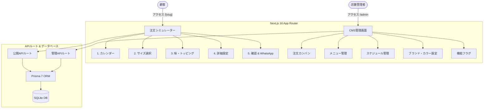

# L'Mere Studio - マルチテナント ケーキ注文シミュレーター & CMS

[](CHANGELOG.md)
[](https://nextjs.org/)
[](https://react.dev/)
[](https://www.typescriptlang.org/)
[](https://www.prisma.io/)
[](https://tailwindcss.com/)
[](LICENSE)

[English](README.md) | [Português](README.pt-BR.md) | [日本語](README.ja.md) | [Español](README.es.md)

L'Mere Studioは、洋菓子店やオーダーメイドケーキデザイナー向けに開発されたホワイトレーベル型マルチテナントWebアプリケーションです。顧客向けの直感的な5ステップ注文シミュレーターと、店舗オーナー向けのセルフサービスCMS管理画面を提供します。

---

## デモンストレーション

### 顧客向け注文シミュレーター (モバイル版)
<video src="./assets/lmere-studio-mobile-demo.mp4" controls="controls" muted="muted" width="100%"></video>

### 店舗向けCMS管理画面 (デスクトップ版)
<video src="./assets/lmere-studio-desktop-demo.mp4" controls="controls" muted="muted" width="100%"></video>

## スクリーンショット

<details>
<summary>ギャラリーを見る（クリックで展開）</summary>
<br>

**顧客フロー (モバイル)**
| カレンダー & 店舗 | サイズ & 人数 | カスタマイズ詳細 |
| :---: | :---: | :---: |
|  |  |  |

**管理画面 (デスクトップ)**
| 注文カンバン | メニュー管理 | ブランドカラー設定 |
| :---: | :---: | :---: |
|  |  |  |

</details>

---

## 主な機能

### 顧客向け注文シミュレーター (`/[slug]`)
- **ステップ 1: イベントカレンダー**: 定休日・予約不可日の自動検証機能を備えたインタラクティブな日付選択。
- **ステップ 2: サイズ & 人数選択**: 人数に応じた最適サイズ（ミニ、S、M、L）と基本料金の自動計算。
- **ステップ 3: スポンジ・フィリング・トッピング**: スポンジ生地、クリーム・フィリング、特別料金トッピングの自由な組み合わせ。
- **ステップ 4: カスタマイズ詳細**: メッセージプレート入力、特別リクエスト、参考画像のURLアップロード。
- **ステップ 5: 注文確認 & 決済受付**: リアルタイムの見積もり計算、内金計算（50% / 100% / 見積りのみ）、PIXキーコピー機能、WhatsApp連携メッセージ生成。

### 店舗向けCMS管理画面 (`/admin`)
- **注文管理**: カンバン形式でのステータス管理（保留中、確認済み、完了、キャンセル）。
- **メニュー管理**: ケーキサイズ、生地、クリーム、追加オプションのCRUD操作。
- **スケジュール管理**: カレンダーの日付ブロック/解除設定。
- **ブランド & デザインカスタマイズ**: ロゴ、バナー、プライマリ・セカンダリカラー、背景テーマのリアルタイム設定。
- **機能設定 (Feature Flags)**: 画像アップロード、配送オプション、内金モードの切り替え。

---

## システム構成図



---

## 技術スタック

| 領域 | 技術 |
| --- | --- |
| フレームワーク | Next.js 16 (App Router, Turbopack) |
| UI & スタイル | React 19, Tailwind CSS v4, グラスモフィズムデザイン |
| アイコン | Lucide React (絵文字完全非使用) |
| データベース | Prisma 7 ORM (`@prisma/adapter-better-sqlite3`) |
| セキュリティ | Bcrypt パスワードハッシュ化 |
| 言語 | TypeScript 5 (Strict Mode) |

---

## セットアップ手順

### 前提条件
- Node.js 20.x 以上
- npm 10.x 以上

### インストール

1. リポジトリのクローン:
   ```bash
   git clone https://github.com/user/lmere-studio.git
   cd lmere-studio
   ```

2. 依存関係のインストール:
   ```bash
   npm install
   ```

3. 環境変数の設定:
   ```bash
   cp .env.example .env
   ```

4. データベースのセットアップとシードデータの投入:
   ```bash
   npx prisma db push --config=prisma.config.ts
   npm run db:seed
   ```

5. 開発サーバーの起動:
   ```bash
   npm run dev
   ```

6. ブラウザでアクセス:
   - **注文シミュレーター**: `http://localhost:3000/doce-arte`
   - **管理画面**: `http://localhost:3000/admin` (ログイン情報: 店舗ID: `doce-arte`, パスワード: `admin123`)

---

## ライセンス

本ソフトウェアは**商用・商標権所有ライセンス (All Rights Reserved)** の下で提供されています。無断での商用利用、再配布、SaaS形式での提供、およびコードの複製は禁止されています。詳細は [LICENSE](LICENSE) を参照してください。
