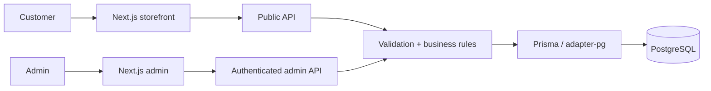
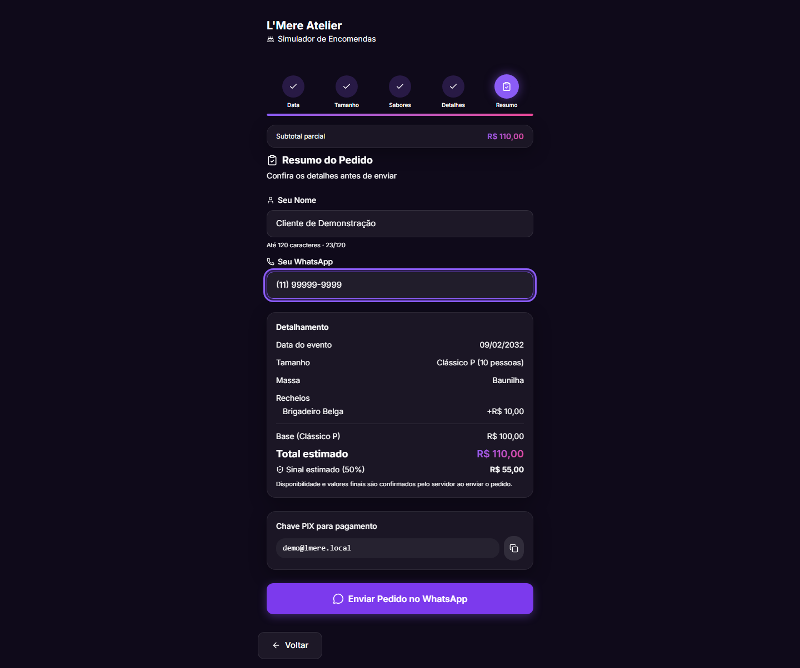
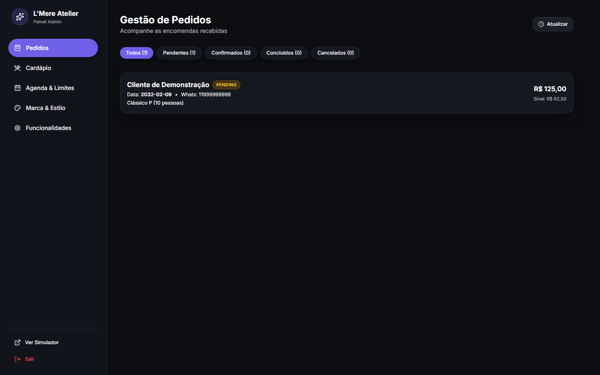
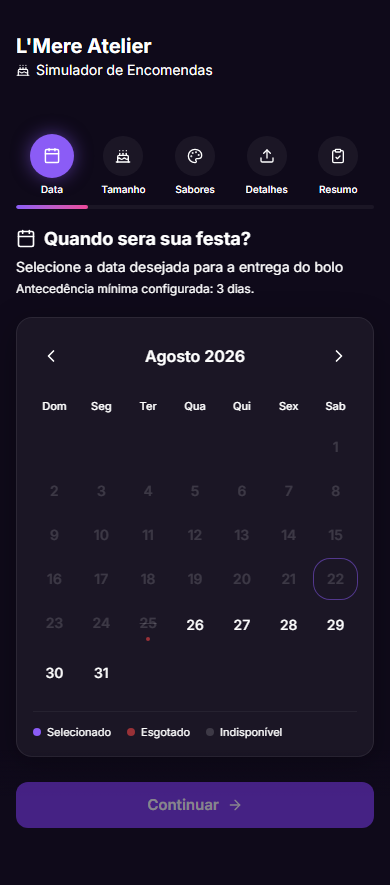
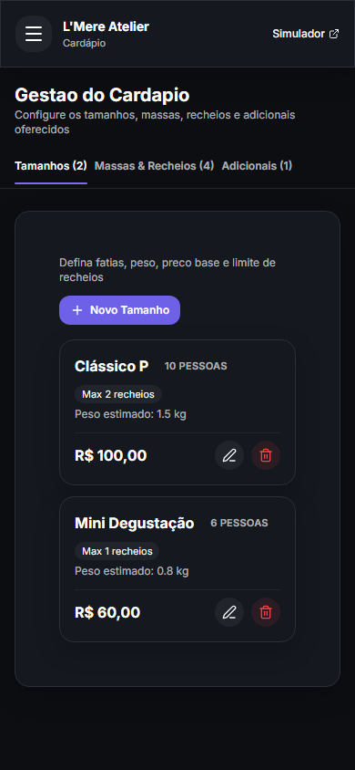

<div align="center">

# L'Mere Studio

**Tenant-aware ordering with server-authoritative business rules.**

L'Mere Studio is a white-label, multi-tenant ordering application for artisan bakeries and cake designers. It combines a configurable public storefront with an authenticated administration workspace while keeping pricing, availability, tenant ownership, and order persistence under server-side authority.

<strong>English</strong> · <a href="docs/i18n/pt-BR/README.md">Português</a> · <a href="docs/i18n/ja/README.md">日本語</a> · <a href="docs/i18n/es/README.md">Español</a>

[](https://github.com/Gyliardson/lmere-studio/actions/workflows/quality.yml)
[](LICENSE)

</div>

## Overview

The public flow lets each tenant expose its own catalog, schedule, branding, capacity, lead-time rules, deposit configuration, and custom order fields. The authenticated admin surface manages those same tenant-scoped resources. Critical order decisions are revalidated by the API against persisted PostgreSQL data before an order is committed or handed off to WhatsApp.

## Why L'Mere Studio?

| Tenant-aware commerce | Authoritative ordering | Reproducible assurance |
| --- | --- | --- |
| Tenant-scoped catalog, schedule, branding, configuration, custom fields, and admin operations. | Active catalog, business dates, capacity, pricing, deposits, and ownership are resolved or verified server-side. | Versioned migrations, deterministic PostgreSQL fixtures, risk-focused tests, and clean-room CI provide bounded evidence for the documented contracts. |

## Core capabilities

- five-step public ordering flow under `/<tenant-slug>`;
- tenant-defined sizes, doughs, fillings, add-ons, schedule, blocked dates, capacity, lead time, branding, and contact settings;
- canonical tenant custom fields with historical order snapshots;
- authenticated admin management for orders, catalog, calendar, custom fields, and settings;
- confirmed WhatsApp handoff only after server validation, pricing, and persistence;
- deterministic desktop/mobile browser verification and reproducible portfolio capture tooling.

## Architecture



The browser is not authoritative for persisted pricing, deposit amounts, availability, tenant ownership, or cross-resource authorization. Detailed boundaries are documented in [Architecture](docs/architecture/ARCHITECTURE.md).

## Technical highlights

- **Multi-tenancy.** Core relational resources carry `tenantId`; protected admin routes derive tenant identity from the verified admin session, and cross-tenant resource mutations are checked against ownership.
- **Server-authoritative pricing and availability.** `/api/orders` reloads active tenant/catalog data, validates lead time, blocked dates, weekly schedule, daily capacity, custom fields, and related IDs, then computes subtotal and deposit from persisted values.
- **Revocable admin sessions.** Admin tokens are HMAC-SHA256 signed, expiry-bound, stored in an HttpOnly `SameSite=Strict` cookie, and validated against the tenant's persisted session generation; logout advances that generation.
- **Transactional order confirmation.** Order creation uses a PostgreSQL serializable transaction with bounded retry for write conflicts and tenant-scoped idempotency keys for retry identity.
- **Historical order meaning.** Confirmed selections, custom-field answers, and financial values are persisted in a server-created snapshot instead of being reconstructed from mutable current catalog state.
- **Deterministic verification.** CI provisions PostgreSQL 16, applies committed migrations, loads deterministic Tenant A/Tenant B fixtures, and exercises static, database, API, browser, security-analysis, and clean-room gates.

## Portfolio views

### Desktop storefront

[](docs/media/portfolio/desktop-storefront-summary.png)

### Desktop admin

[](docs/media/portfolio/desktop-admin-orders.png)

### Mobile storefront and admin catalog

<p align="center">
  <a href="docs/media/portfolio/mobile-storefront.png"></a>
  <a href="docs/media/portfolio/mobile-admin-menu.png"></a>
</p>

## Quick Start

Requirements: Node.js **22+** and PostgreSQL or a PostgreSQL-compatible hosted service.

```bash
git clone https://github.com/Gyliardson/lmere-studio.git
cd lmere-studio
npm ci
cp .env.example .env
npm run db:generate
npm run db:migrate
npm run dev
```

Configure `POSTGRES_PRISMA_URL` and replace the `ADMIN_SESSION_SECRET` placeholder with unique secret material before running the application. The optional demo seed is destructive and intentionally requires explicit opt-in; review [.env.example](.env.example) and the [quality documentation](docs/assurance/QUALITY.md) before using it.

## Quality & assurance

The repository separates behavior checks from documentation capture. `npm run quality` covers lint, typechecking, unit tests, Prisma validation, and the production build; Playwright E2E, disposable-PostgreSQL integration, dependency audit, full-history secret scanning, CodeQL, and exact-candidate clean-room verification run in GitHub Actions.

These checks provide evidence for specific repository contracts. They are not a claim of complete WCAG conformance, universal vulnerability absence, or production readiness. See [Quality and test gates](docs/assurance/QUALITY.md) and [Release and clean-room verification](docs/operations/RELEASE.md).

## Documentation

[Technical documentation](docs/README.md) is organized by architecture, assurance, operations, internationalized project overviews, and media assets.

Useful entry points:

- [Architecture boundaries](docs/architecture/ARCHITECTURE.md)
- [Quality and test gates](docs/assurance/QUALITY.md)
- [Release and clean-room verification](docs/operations/RELEASE.md)
- [Reproducible portfolio media](docs/operations/MEDIA.md)

## Limitations / operational boundaries

- Automated accessibility checks are representative regression coverage, not complete WCAG certification.
- Generated portfolio media requires manual visual inspection before publication.
- External HTTPS image references can expose ordinary network metadata to the referenced host when a browser renders them; the application does not fetch those URLs server-side.
- Repository branch protection and rulesets are governance controls outside the application's correctness model and must be checked independently when release evidence requires them.
- A successful CI run proves the bounded checks implemented by the repository; it does not prove every deployment environment or external service configuration.

## License

L'Mere-owned source, architecture, design assets, database schemas, and documentation are **Proprietary / All Rights Reserved**. Copying, redistribution, hosting, modification, or commercial use requires explicit permission except where applicable third-party licenses independently grant rights to retained third-party material. See [LICENSE](LICENSE) and [THIRD_PARTY_NOTICES.md](THIRD_PARTY_NOTICES.md).

## Author

**Gyliardson Keitison** · [GitHub](https://github.com/Gyliardson)
