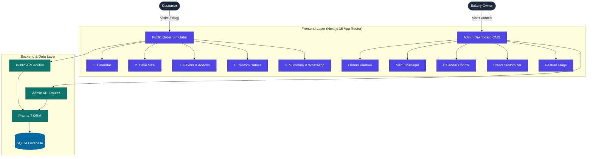

# L'Mere Studio - Multi-Tenant Cake Order Simulator & CMS

[](CHANGELOG.md)
[](https://nextjs.org/)
[](https://react.dev/)
[](https://www.typescriptlang.org/)
[](https://www.prisma.io/)
[](https://tailwindcss.com/)
[](LICENSE)

[English](README.md) | [Português](README.pt-BR.md) | [日本語](README.ja.md) | [Español](README.es.md)

L'Mere Studio is a white-label, multi-tenant Web Application designed for artisan bakeries, cake designers, and confectioneries. It provides an intuitive 5-step interactive cake order simulator for end customers and a self-service CMS Admin Dashboard for bakery owners.

---

## Demonstration

### Public Order Simulator (Mobile Flow)
<video src="./assets/lmere-studio-mobile-demo.mp4" controls="controls" muted="muted" width="100%"></video>

### Admin CMS Dashboard (Desktop Flow)
<video src="./assets/lmere-studio-desktop-demo.mp4" controls="controls" muted="muted" width="100%"></video>

## Screenshots

<details>
<summary>Click to view Gallery</summary>
<br>

**Customer Flow (Mobile)**
| Storefront & Calendar | Size & Portions | Flavors & Details |
| :---: | :---: | :---: |
|  |  |  |

**Admin Dashboard (Desktop)**
| Order Kanban | Menu Editor | Brand Customizer |
| :---: | :---: | :---: |
|  |  |  |

</details>

---

## Key Features

### Public Order Simulator (`/[slug]`)
- **Step 1: Event Calendar**: Interactive date selection with automated blocked-date validation and minimum lead-time rules.
- **Step 2: Portion & Size Selection**: Dynamic weight and portion recommendations (Mini, Small, Medium, Large) with base pricing.
- **Step 3: Flavors & Add-ons Builder**: Customizable options for cake doughs, fillings (single/multiple select), special flavor surcharges, and optional add-ons (toppers, custom boxes).
- **Step 4: Customization Details**: Plaque message input, custom instructions, and optional reference photo URL upload.
- **Step 5: Summary & Instant Checkout**: Live price breakdown, automated deposit calculations (50% signal / 100% full / quote-only), one-click PIX key copy, and formatted WhatsApp message dispatch.

### Self-Service Admin CMS Panel (`/admin`)
- **Order Management**: Kanban-style status tracking (Pending, Confirmed, Completed, Cancelled).
- **Menu Management**: Full CRUD controls for cake sizes, doughs, fillings, special categories, pricing, and add-ons.
- **Schedule Control**: Single-click date blocking/unblocking and weekly schedule rules.
- **Brand & Theme Customizer**: Real-time styling engine to update logos, banners, primary/secondary colors, background themes, and contact info per tenant.
- **Feature Toggles**: Configurable switches for photo uploads, delivery options, and deposit modes.

---

## Architecture Overview



---

## Tech Stack

| Domain | Technology |
| --- | --- |
| Framework | Next.js 16 (App Router, Turbopack) |
| UI & Styling | React 19, Tailwind CSS v4, Glassmorphism Design System |
| Icons | Lucide React (Strict Zero-Emoji Standard) |
| Database | Prisma 7 ORM with `@prisma/adapter-better-sqlite3` |
| Security | Bcrypt password hashing |
| Language | TypeScript 5 (Strict Mode) |

---

## Getting Started

### Prerequisites
- Node.js 20.x or higher
- npm 10.x or higher

### Installation

1. Clone the repository:
   ```bash
   git clone https://github.com/user/lmere-studio.git
   cd lmere-studio
   ```

2. Install dependencies:
   ```bash
   npm install
   ```

3. Set up environment variables:
   ```bash
   cp .env.example .env
   ```

4. Push database schema and run seed script:
   ```bash
   npx prisma db push --config=prisma.config.ts
   npm run db:seed
   ```

5. Start the development server:
   ```bash
   npm run dev
   ```

6. Open your browser:
   - **Public Simulator**: `http://localhost:3000/doce-arte`
   - **Admin CMS**: `http://localhost:3000/admin` (Credentials: Slug: `doce-arte`, Password: `admin123`)

---

## API Routes Reference

| Endpoint | Method | Description | Access |
| --- | --- | --- | --- |
| `/api/tenants/[slug]` | `GET` | Fetches tenant public branding, menu, and schedule | Public |
| `/api/orders` | `POST` | Creates a new order submission | Public |
| `/api/admin/auth` | `POST` | Authenticates bakery admin credentials | Admin |
| `/api/admin/orders` | `GET`, `PATCH` | Lists orders and updates order status | Admin |
| `/api/admin/menu` | `GET`, `POST`, `PUT`, `DELETE` | CRUD for cake sizes, flavors, and add-ons | Admin |
| `/api/admin/calendar` | `GET`, `POST`, `DELETE` | Manages blocked dates | Admin |
| `/api/admin/settings` | `GET`, `PUT` | Manages tenant branding, colors, and features | Admin |

---

## License

This software is licensed under a **Proprietary License (All Rights Reserved)**. Commercial usage, distribution, hosting as a SaaS service, or code copying without prior consent is strictly prohibited. See [LICENSE](LICENSE) for details.
