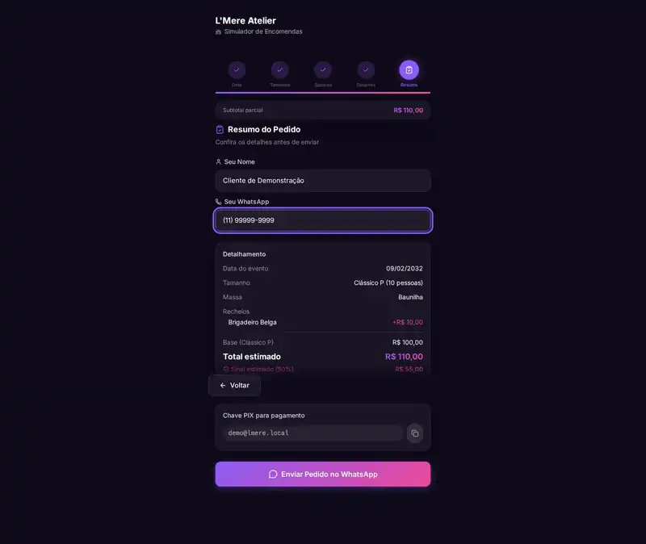
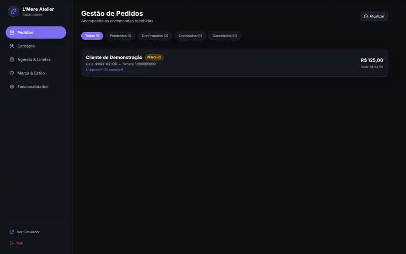
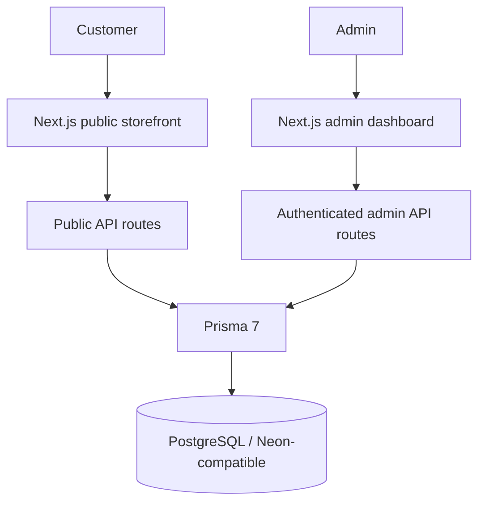

# L'Mere Studio — Multi-Tenant Cake Order Simulator & CMS

[](CHANGELOG.md)
[](https://nextjs.org/)
[](https://react.dev/)
[](https://www.prisma.io/)
[](LICENSE)

[English](README.md) | [Português](README.pt-BR.md) | [日本語](README.ja.md) | [Español](README.es.md)

L'Mere Studio is a white-label, multi-tenant web application for artisan bakeries and cake designers. It combines a five-step public order simulator with an authenticated admin dashboard for orders, catalog, schedule, branding and tenant configuration.

> **Portfolio engineering baseline:** PR #27 promoted the professionalization work to the default `master` branch. The repository documents behavior that is implemented and covered by the reproducible quality gates described below; future releases remain manual maintainer review decisions under [`docs/RELEASE.md`](docs/RELEASE.md).

## Problem → solution

Small custom-order businesses often coordinate availability, configurable products, pricing and customer handoff across disconnected messages and spreadsheets. L'Mere centralizes those rules in a tenant-aware storefront while keeping critical pricing, availability and persistence authoritative on the server.

The portfolio case highlights:

- tenant-scoped catalog, schedule, branding, custom fields and admin operations;
- server-authoritative order pricing and availability validation;
- HMAC-signed, revocable admin sessions and ownership checks;
- PostgreSQL migrations and deterministic two-tenant fixtures;
- risk-focused unit, integration and Playwright coverage;
- reproducible desktop/mobile documentation captures.

## Reproducible demonstration media

README evidence no longer depends on prerecorded videos, fake cursors, narration, subtitles, background music or ffmpeg post-production. Current portfolio screenshots are produced from synthetic PostgreSQL fixtures with a dedicated Playwright command that is intentionally separate from behavioral E2E tests:

```bash
npm run demo:capture
```

See [`docs/MEDIA.md`](docs/MEDIA.md) for the clean capture sequence, prerequisites, deterministic data contract and expected outputs under `docs/media/generated/`.

The normal browser gate remains separate:

```bash
npm run test:e2e
```

### Curated portfolio evidence

The four images below are a compact selection from the deterministic capture pipeline. They use synthetic fixtures only and were manually reviewed for containment, hierarchy, spacing and obvious responsive regressions before publication.

| Storefront — desktop summary | Admin — desktop orders |
| --- | --- |
|  |  |

| Storefront — mobile | Admin — mobile catalog |
| --- | --- |
|  |  |

## Key features

### Public order simulator (`/[slug]`)

1. **Calendar:** tenant work schedule, blocked dates and minimum lead time.
2. **Size:** tenant-defined portions, weight, base price and filling limits.
3. **Flavors & add-ons:** active doughs, fillings, special-price options and extras.
4. **Customization:** plaque message, notes, optional reference image and canonical tenant-defined text/select/number fields.
5. **Confirmed handoff:** the server revalidates catalog/date/capacity/custom-field rules, recalculates subtotal/deposit, persists the order and only then provides confirmed values for WhatsApp handoff.

### Authenticated admin (`/admin`)

- order status management;
- size/flavor/add-on CRUD;
- tenant custom-field CRUD;
- weekly schedule and blocked-date management;
- tenant branding and contact configuration;
- feature/deposit/capacity/lead-time settings;
- responsive desktop/mobile navigation and keyboard-focused accessibility regressions.

## Architecture



### Database/runtime contract

- Prisma provider: **PostgreSQL**.
- Canonical connection variable: `POSTGRES_PRISMA_URL`.
- Runtime adapter: `@prisma/adapter-pg`.
- Production may use Neon; local/CI uses ordinary PostgreSQL TCP.
- Empty databases are bootstrapped with committed `prisma migrate deploy` migrations.
- CI uses disposable PostgreSQL 16 and deterministic Tenant A/Tenant B fixtures.

### Security model

- Admin authentication creates an expiry-bound HMAC-SHA256 session stored in an HttpOnly, `SameSite=Strict` cookie; production cookies are `Secure`.
- `ADMIN_SESSION_SECRET` is required and must contain at least 32 bytes of unique secret material.
- Protected admin routes derive tenant identity from the verified session, not request-provided tenant IDs.
- Logout advances a persisted tenant session generation so copied tokens from the prior generation are rejected by protected admin routes.
- Cross-tenant resource mutations verify ownership.
- Public order creation treats browser subtotal, deposit, availability and related IDs as untrusted.
- The server re-resolves active catalog resources and canonical custom-field definitions, validates business dates/capacity, recalculates financials and uses serializable PostgreSQL transactions with bounded retry.
- Public login/order abuse controls use persistent privacy-preserving rate-limit buckets.

## Tech stack

| Area | Technology |
| --- | --- |
| Framework | Next.js 16.3.0 App Router |
| UI | React 19.2.4, Tailwind CSS v4, Lucide React |
| Language | TypeScript 5 |
| Database | PostgreSQL, Prisma 7.9.1, `@prisma/adapter-pg` |
| Password hashing | bcryptjs |
| Browser verification | Playwright |
| CI database | Disposable PostgreSQL 16 |

## Getting started

### Prerequisites

- Node.js **22+**
- npm compatible with the selected Node release
- PostgreSQL or a PostgreSQL-compatible hosted database such as Neon

### Development

```bash
git clone https://github.com/Gyliardson/lmere-studio.git
cd lmere-studio
npm ci
cp .env.example .env
npm run db:generate
npm run db:migrate
# Optional destructive synthetic demo data, local/disposable database only:
LMERE_ALLOW_DEMO_SEED=true npm run db:seed
npm run dev
```

Set `POSTGRES_PRISMA_URL` to your development database and replace the placeholder `ADMIN_SESSION_SECRET` with unique secret material. Never commit real credentials.

`npm run db:seed` is **not** a production/bootstrap step. It deliberately replaces the synthetic `doce-arte` tenant and installs a known demo-only admin credential, so the command fails closed in `NODE_ENV=production` and requires `LMERE_ALLOW_DEMO_SEED=true` before the destructive seed process is launched. The preflight prints only `host[:port]/database`; usernames, passwords and connection query parameters are never echoed. Production/bootstrap uses `npm run db:migrate` only.

### Quality commands

```bash
npm run quality
npm run test:e2e
```

For the complete disposable-PostgreSQL CI contract, see [`docs/QUALITY.md`](docs/QUALITY.md). For documentation capture, see [`docs/MEDIA.md`](docs/MEDIA.md).

### Database commands

- `npm run db:generate` — generate Prisma Client.
- `npm run db:migrate` — apply committed migrations with `prisma migrate deploy`; this is the production/bootstrap database command.
- `npm run db:validate` — validate Prisma schema/config.
- `LMERE_ALLOW_DEMO_SEED=true npm run db:seed` — optional **destructive synthetic** local/demo seed; refused in production and without explicit opt-in.
- `npm run db:push` — development-only schema synchronization; not the CI/production bootstrap strategy.

## Quality evidence

The repository-owned gates cover, among other checks:

- ESLint, TypeScript and production build;
- production dependency audit, read-only full-history secret scanning and CodeQL JavaScript/TypeScript SAST with auditable post-processed SARIF;
- unit tests for pricing, business dates, sessions, validation and configuration;
- empty PostgreSQL migrations, deterministic Tenant A/B fixtures and relational assertions;
- application smoke against disposable PostgreSQL;
- server-authoritative order negative paths, idempotency and concurrency;
- authenticated Tenant A/B admin isolation and cross-tenant mutation rejection;
- login/session restoration/logout/revocation behavior;
- responsive desktop/mobile Playwright checks;
- representative axe scans plus keyboard/focus/dialog/combobox regressions and reduced-motion behavior;
- deterministic visual-review artifacts that are manually inspected for UI issues;
- exact-candidate clean-room verification from fresh checkout through PostgreSQL, build, runtime and E2E.

This is risk-focused regression evidence, not a claim of complete WCAG certification or a substitute for final release review.

## API surface

| Endpoint | Methods | Intent |
| --- | --- | --- |
| `/api/tenants/[slug]` | `GET` | Public tenant branding, menu, schedule and validated custom-field definitions |
| `/api/orders` | `POST` | Server-authoritative order validation/pricing/persistence |
| `/api/admin/auth` | `POST`, `GET`, `DELETE` | Login, session validation and logout |
| `/api/admin/orders` | `GET`, `PUT` | Tenant-scoped order management |
| `/api/admin/menu` | `GET`, `POST`, `PUT`, `DELETE` | Tenant-scoped catalog CRUD |
| `/api/admin/calendar` | `GET`, `POST`, `PUT`, `DELETE` | Tenant-scoped schedule management |
| `/api/admin/settings` | `GET`, `PUT` | Tenant-scoped branding/configuration |
| `/api/admin/custom-fields` | `GET`, `POST`, `PUT`, `DELETE` | Tenant-scoped canonical custom-field CRUD |

## Limitations / release status

- PR #27 has already promoted the professionalization baseline to `master`; future changes follow the durable exact-SHA release/verification contract in [`docs/RELEASE.md`](docs/RELEASE.md) and remain manual maintainer merge decisions.
- Generated documentation media must be manually inspected before publication.
- The accessibility suite is representative risk coverage, not comprehensive WCAG certification.
- Repository branch/ruleset enforcement is a governance setting outside application correctness and must be checked at release time.

## License

L'Mere-owned source is **Proprietary / All Rights Reserved**. Commercial usage, distribution, SaaS hosting or copying of L'Mere-owned code requires explicit permission. Retained third-party material remains governed by its own licenses; applicable attributions are recorded in [THIRD_PARTY_NOTICES.md](THIRD_PARTY_NOTICES.md). See [LICENSE](LICENSE).
