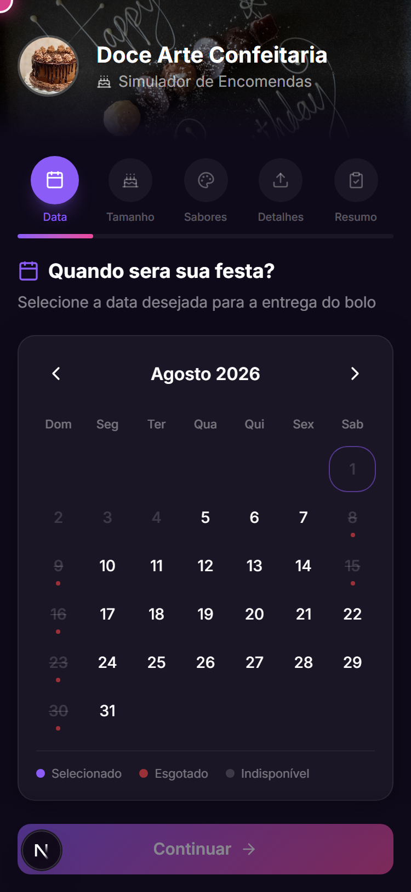
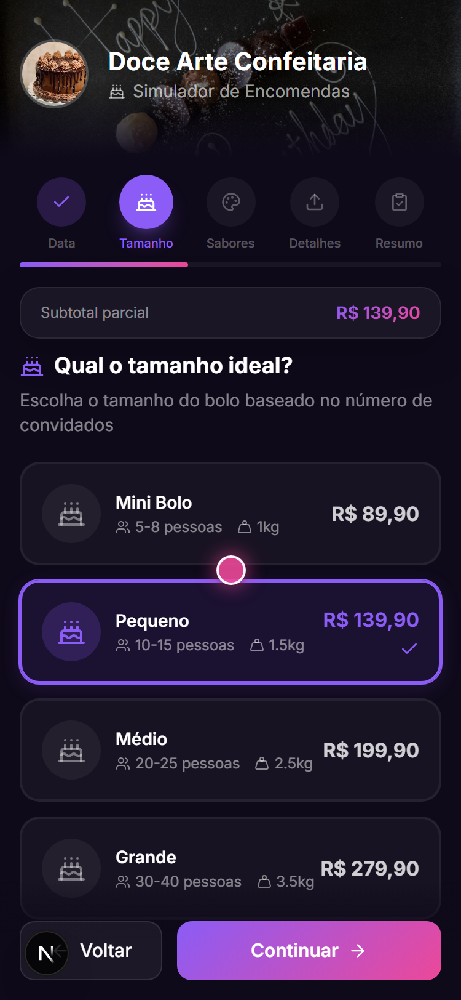
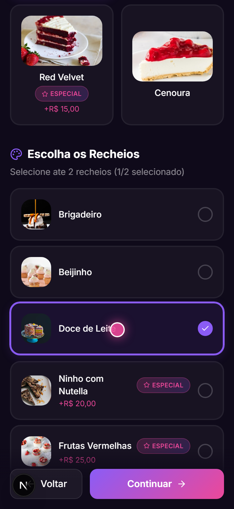
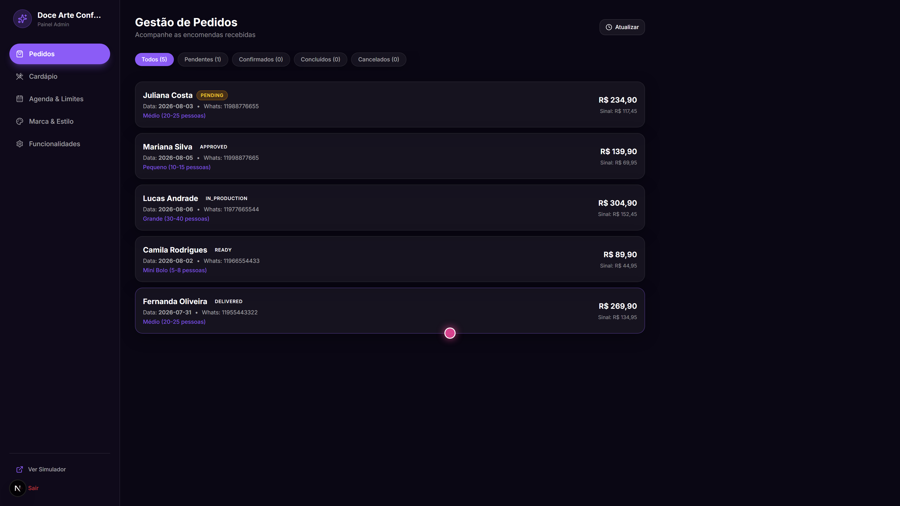
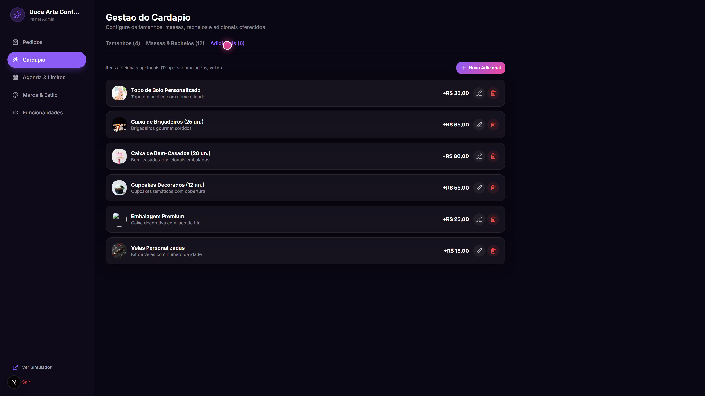
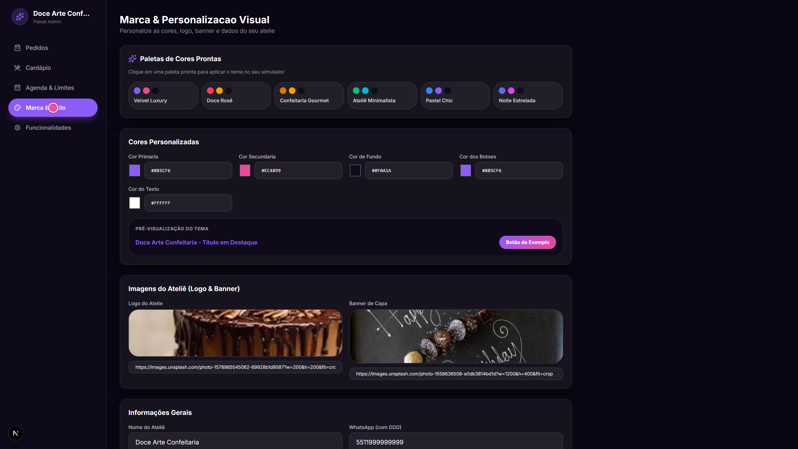
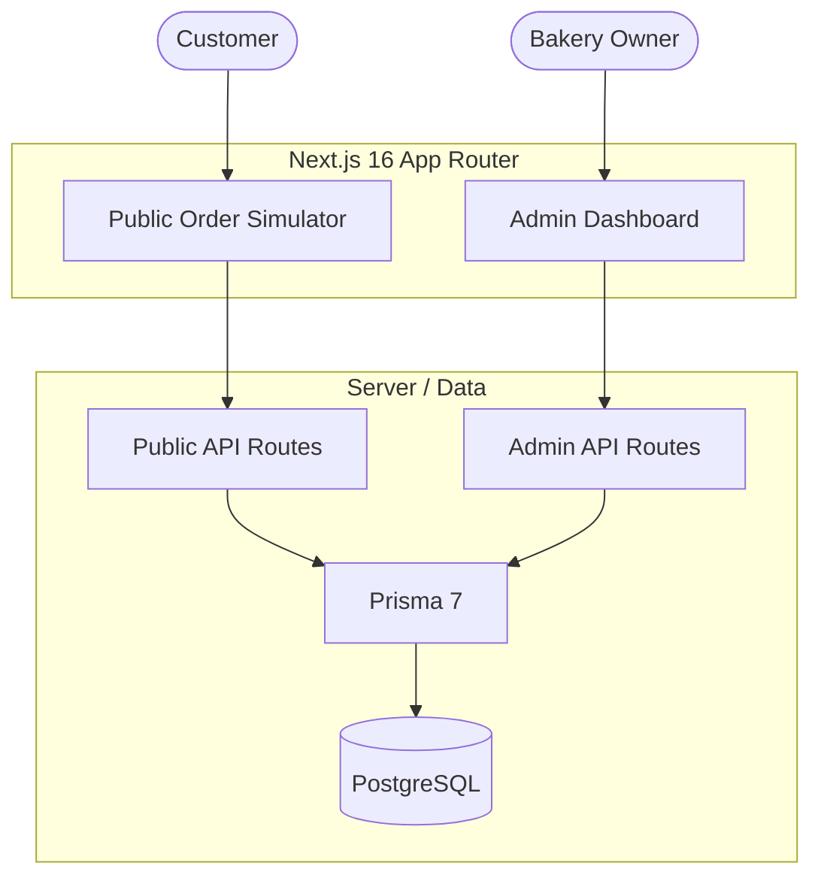

# L'Mere Studio - Multi-Tenant Cake Order Simulator & CMS

[](CHANGELOG.md)
[](https://nextjs.org/)
[](https://react.dev/)
[](https://www.typescriptlang.org/)
[](https://www.prisma.io/)
[](https://tailwindcss.com/)
[](LICENSE)

[English](README.md) | [Português](README.pt-BR.md) | [日本語](README.ja.md) | [Español](README.es.md)

L'Mere Studio is a white-label, multi-tenant web application for artisan bakeries, cake designers, and confectioneries. It combines a five-step public cake-order flow with a self-service admin dashboard for catalog, schedule, branding, and order management.

> **Professionalization in progress:** the `portfolio/revamp-2026` program is actively hardening server-side business rules, security, accessibility, documentation, and reproducibility. The current README describes only behavior and infrastructure that exist in the repository; release-grade certification is intentionally deferred until the corresponding gates are complete.

---

## Demonstration

### Public Order Simulator (Mobile Flow)
<video src="./assets/lmere-studio-mobile-demo.mp4" controls="controls" muted="muted" width="100%"></video>

### Admin CMS Dashboard (Desktop Flow)
<video src="./assets/lmere-studio-desktop-demo.mp4" controls="controls" muted="muted" width="100%"></video>

## Screenshots

<details>
<summary>Click to view Gallery</summary>
<br>

**Customer Flow (Mobile)**
| Storefront & Calendar | Size & Portions | Flavors & Details |
| :---: | :---: | :---: |
|  |  |  |

**Admin Dashboard (Desktop)**
| Order Kanban | Menu Editor | Brand Customizer |
| :---: | :---: | :---: |
|  |  |  |

</details>

---

## Key Features

### Public Order Simulator (`/[slug]`)
- **Step 1: Event Calendar**: date selection backed by tenant schedule, blocked dates, lead-time, and capacity configuration.
- **Step 2: Portion & Size Selection**: tenant-defined sizes, portions, weight, base price, and filling limits.
- **Step 3: Flavors & Add-ons Builder**: doughs, fillings, special-price options, and tenant-defined add-ons.
- **Step 4: Customization Details**: plaque message, customer notes, and optional reference-photo URL.
- **Step 5: Summary & Checkout Handoff**: price/deposit summary, PIX information, and formatted WhatsApp handoff.

### Self-Service Admin CMS Panel (`/admin`)
- **Order Management**: Kanban-style order status tracking.
- **Menu Management**: CRUD controls for sizes, doughs, fillings, pricing, and add-ons.
- **Schedule Control**: blocked-date and weekly schedule management.
- **Brand & Theme Customizer**: per-tenant logos, banners, colors, and contact information.
- **Feature Toggles**: configurable behavior stored per tenant.

---

## Architecture Overview



### Database/runtime contract

- Prisma schema provider: **PostgreSQL**.
- Application runtime and Prisma tooling use the canonical `POSTGRES_PRISMA_URL` connection variable.
- Prisma runtime uses `@prisma/adapter-pg`, so ordinary PostgreSQL TCP works locally and in disposable CI while Neon remains a compatible production PostgreSQL provider.
- CI uses a disposable **PostgreSQL 16** service and never depends on live Neon credentials.
- Versioned migrations bootstrap an empty database via `prisma migrate deploy`.
- Deterministic CI fixtures create two tenants for relational and isolation-oriented tests.

### Administrative security boundary

- Administrative authentication creates an expiry-bound HMAC-SHA256 session token.
- The token is stored in an HttpOnly cookie with `SameSite=Strict`; production cookies are marked `Secure`.
- `ADMIN_SESSION_SECRET` is required and must contain at least 32 bytes of unique secret material.
- Admin order, menu, calendar, and settings routes derive tenant identity from the verified server-side session rather than trusting request-supplied tenant IDs.
- Mutations that target existing tenant resources verify ownership before changing or deleting them.
- The `/admin` client restores an existing valid session before deciding whether to show the login form, and its logout controls revoke the server cookie before clearing local authenticated state.
- CI exercises unauthenticated negative paths, authenticated Tenant A != Tenant B isolation, refresh restoration, and server-backed logout persistence against disposable PostgreSQL.

---

## Tech Stack

| Domain | Technology |
| --- | --- |
| Framework | Next.js 16.3.0 (App Router) |
| UI & Styling | React 19.2.4, Tailwind CSS v4 |
| Icons | Lucide React |
| Database | PostgreSQL, Prisma 7.9.1, `@prisma/adapter-pg` |
| Password hashing | bcryptjs |
| Admin sessions | HMAC-SHA256 signed HttpOnly cookie |
| Language | TypeScript 5 |
| Browser testing | Playwright |
| CI database | Disposable PostgreSQL 16 |

---

## Getting Started

### Prerequisites
- Node.js **22.x or higher**
- npm compatible with the selected Node.js release
- PostgreSQL locally, or a PostgreSQL-compatible hosted connection such as Neon

### Installation

1. Clone the repository:
   ```bash
   git clone https://github.com/Gyliardson/lmere-studio.git
   cd lmere-studio
   ```

2. Install the locked dependencies:
   ```bash
   npm ci
   ```

3. Set up environment variables:
   ```bash
   cp .env.example .env
   ```
   Set `POSTGRES_PRISMA_URL` to the development PostgreSQL connection and replace the placeholder `ADMIN_SESSION_SECRET` with a unique random value containing at least 32 bytes. Never commit a real session secret.

4. Generate Prisma Client and apply versioned migrations:
   ```bash
   npm run db:generate
   npm run db:migrate
   ```

5. Optional development/demo seed:
   ```bash
   npm run db:seed
   ```
   Treat demo data and credentials as local/development-only. Do not reuse them for production deployments.

6. Run the same static quality gates used by CI:
   ```bash
   npm run quality
   ```

7. Run browser verification after preparing the deterministic test database and a production build:
   ```bash
   npm run test:e2e
   ```
   See [`docs/QUALITY.md`](docs/QUALITY.md) for the complete quality/test contract and database prerequisites.

8. Start the development server:
   ```bash
   npm run dev
   ```

The public storefront is available at `/<tenant-slug>` and the admin interface at `/admin`.

### Database helper scripts

- `npm run db:migrate` — applies committed migrations with `prisma migrate deploy`.
- `npm run db:validate` — validates the Prisma schema/configuration.
- `npm run db:push` — development-only schema synchronization; do not use it as the production/CI migration strategy.

---

## Automated Quality Foundation

Current CI on the professionalization branch verifies:

- dependency installation from `package-lock.json`;
- production dependency audit blocking high/critical findings;
- Prisma Client generation;
- ESLint with a retained machine-readable report;
- TypeScript typecheck;
- risk-focused pricing/deposit and admin-session unit tests;
- Prisma schema validation;
- production build;
- PostgreSQL 16 startup;
- migrations from an empty database;
- deterministic Tenant A / Tenant B fixture creation;
- database-level relational/constraint negative paths;
- application build/start against disposable PostgreSQL;
- public tenant API smoke for Tenant A, non-exposure of the admin password hash, absence of Tenant B fixture leakage, and 404 behavior for an unknown tenant;
- deterministic Playwright smoke on desktop and mobile for storefront loading, Tenant B fixture non-leakage, and the missing-tenant state;
- unauthenticated negative-path checks for protected admin routes;
- authenticated Tenant A/B isolation checks proving request-supplied tenant IDs cannot redirect tested reads/mutations across tenants;
- cross-tenant mutation checks for menu resources, blocked dates, and orders;
- admin browser session restoration and server-backed logout persistence across reloads on desktop and mobile;
- an initial accessibility role/landmark smoke on desktop and mobile;
- read-only Gitleaks secret scanning;
- post-test migration status;
- server diagnostics and Playwright trace/screenshot/video artifacts on relevant failures.

The browser accessibility smoke is intentionally narrow and is not a claim of complete WCAG compliance. The admin session and tenant-isolation boundary has automated unit/API/browser evidence, while deeper keyboard/focus/contrast/axe coverage and additional static security analysis remain later program work.

---

## API Routes Reference

| Endpoint | Method | Description | Access intent |
| --- | --- | --- | --- |
| `/api/tenants/[slug]` | `GET` | Tenant public branding, menu, and schedule | Public |
| `/api/orders` | `POST` | Order submission | Public |
| `/api/admin/auth` | `POST`, `GET`, `DELETE` | Authenticate, validate current session, and clear session cookie | Admin |
| `/api/admin/orders` | `GET`, `PUT` | Tenant-scoped order listing/status updates | Admin session |
| `/api/admin/menu` | `GET`, `POST`, `PUT`, `DELETE` | Tenant-scoped menu CRUD with ownership checks | Admin session |
| `/api/admin/calendar` | `GET`, `POST`, `PUT`, `DELETE` | Tenant-scoped schedule and blocked-date management | Admin session |
| `/api/admin/settings` | `GET`, `PUT` | Tenant-scoped branding/configuration | Admin session |

> The administrative API routes above enforce the validated session tenant and have automated Tenant A/B negative-path coverage, including browser refresh/logout lifecycle checks. This is not a final project security certification: public order submission is still undergoing separate server-authority hardening in #3.

---

## License

This software is licensed under a **Proprietary License (All Rights Reserved)**. Commercial usage, distribution, hosting as a SaaS service, or code copying without prior consent is prohibited except with explicit permission. See [LICENSE](LICENSE) for details.
