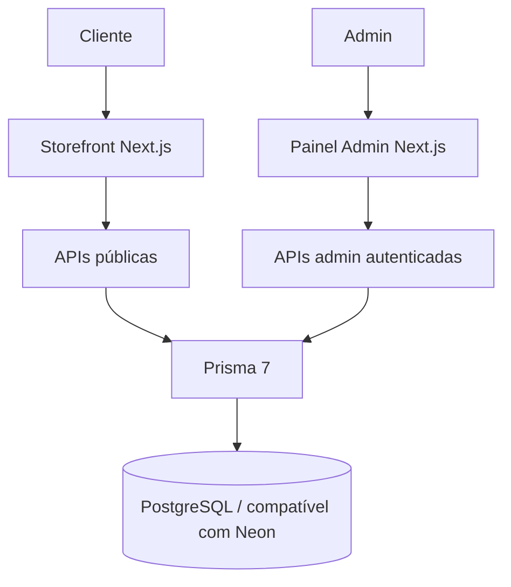

# L'Mere Studio — Simulador de Encomendas & CMS Multi-Tenant

[](CHANGELOG.md)
[](https://nextjs.org/)
[](https://react.dev/)
[](https://www.prisma.io/)
[](LICENSE)

[English](README.md) | [Português](README.pt-BR.md) | [日本語](README.ja.md) | [Español](README.es.md)

L'Mere Studio é uma aplicação white-label e multi-tenant para ateliês de confeitaria e cake designers. Combina um simulador público de encomendas em cinco etapas com um painel administrativo autenticado para pedidos, catálogo, agenda, marca e configurações do tenant.

> **Baseline de engenharia do portfólio:** a documentação descreve comportamento implementado e coberto pelos gates reproduzíveis de qualidade abaixo. A promoção para a branch padrão permanece uma decisão de revisão manual.

## Problema → solução

Encomendas personalizadas exigem conciliar disponibilidade, catálogo configurável, regras financeiras e comunicação com o cliente. O L'Mere centraliza essas regras numa experiência multi-tenant, mantendo preço, disponibilidade e persistência críticos sob autoridade do servidor.

O case técnico demonstra:

- catálogo, agenda, branding e administração isolados por tenant;
- preço e disponibilidade recalculados no servidor;
- sessão admin HMAC assinada e verificações de ownership;
- PostgreSQL com migrations versionadas e fixtures determinísticas de dois tenants;
- testes unitários, integração e Playwright orientados a risco;
- captura reproduzível de evidências desktop/mobile.

## Mídia de demonstração reproduzível

A documentação não depende mais de vídeos pré-gravados, cursor falso, narração, legendas, música de fundo ou pós-processamento com ffmpeg. As capturas atuais são produzidas com dados PostgreSQL sintéticos por um comando Playwright separado da suíte comportamental:

```bash
npm run demo:capture
```

Veja [`docs/MEDIA.md`](docs/MEDIA.md) para pré-requisitos, bootstrap limpo, dados determinísticos e arquivos gerados em `docs/media/generated/`.

Os testes E2E continuam separados:

```bash
npm run test:e2e
```

## Funcionalidades

### Simulador público (`/[slug]`)

1. **Calendário:** agenda semanal, datas bloqueadas e antecedência mínima do tenant.
2. **Tamanho:** porções, peso, preço-base e limite de recheios configurados pelo tenant.
3. **Sabores e adicionais:** massas, recheios, especiais e extras ativos.
4. **Personalização:** mensagem, observações e imagem de referência opcional.
5. **Finalização confirmada:** o servidor revalida catálogo/data/capacidade, recalcula subtotal/sinal, persiste o pedido e só então entrega valores confirmados para o handoff ao WhatsApp.

### Admin autenticado (`/admin`)

- gestão de status de pedidos;
- CRUD de tamanhos, sabores/recheios e adicionais;
- agenda semanal e datas bloqueadas;
- branding/contato por tenant;
- configuração de funcionalidades, sinal, capacidade e lead time;
- navegação responsiva e regressões de teclado/foco em desktop/mobile.

## Arquitetura



### Contrato de banco/runtime

- Provider Prisma: **PostgreSQL**.
- Variável canônica: `POSTGRES_PRISMA_URL`.
- Adapter runtime: `@prisma/adapter-pg`.
- Produção pode usar Neon; local/CI usa PostgreSQL TCP comum.
- Banco vazio é preparado com migrations versionadas via `prisma migrate deploy`.
- CI usa PostgreSQL 16 descartável e fixtures Tenant A/Tenant B.

### Modelo de segurança

- Sessão admin HMAC-SHA256 com expiração em cookie HttpOnly e `SameSite=Strict`; produção usa `Secure`.
- `ADMIN_SESSION_SECRET` exige pelo menos 32 bytes de material secreto único.
- Rotas admin derivam tenant da sessão verificada, não de `tenantId` enviado pelo cliente.
- Mutações de recursos existentes verificam ownership.
- `/api/orders` trata subtotal, sinal, disponibilidade e IDs enviados pelo navegador como não confiáveis.
- Servidor re-resolve catálogo ativo, calendário/capacidade e financeiro dentro de transação PostgreSQL serializável com retry limitado.
- Login e pedidos públicos possuem rate limiting persistente.

## Stack

| Área | Tecnologia |
| --- | --- |
| Framework | Next.js 16.3.0 App Router |
| UI | React 19.2.4, Tailwind CSS v4, Lucide React |
| Linguagem | TypeScript 5 |
| Banco | PostgreSQL, Prisma 7.9.1, `@prisma/adapter-pg` |
| Hash de senha | bcryptjs |
| Browser tests | Playwright |
| Banco de CI | PostgreSQL 16 descartável |

## Instalação

Pré-requisitos: Node.js **22+**, npm compatível e PostgreSQL/Neon.

```bash
git clone https://github.com/Gyliardson/lmere-studio.git
cd lmere-studio
npm ci
cp .env.example .env
npm run db:generate
npm run db:migrate
# Seed sintético destrutivo opcional, apenas em banco local/descartável:
LMERE_ALLOW_DEMO_SEED=true npm run db:seed
npm run dev
```

Configure `POSTGRES_PRISMA_URL` para o banco de desenvolvimento e substitua o placeholder de `ADMIN_SESSION_SECRET` por segredo único. Nunca versione credenciais reais.

`npm run db:seed` **não** é etapa de produção/bootstrap. Ele substitui deliberadamente o tenant sintético `doce-arte`, é recusado quando `NODE_ENV=production` e exige `LMERE_ALLOW_DEMO_SEED=true`. O bootstrap de produção usa apenas `npm run db:migrate`.

### Qualidade

```bash
npm run quality
npm run test:e2e
```

O contrato completo de CI/PostgreSQL está em [`docs/QUALITY.md`](docs/QUALITY.md). A captura de documentação está em [`docs/MEDIA.md`](docs/MEDIA.md).

### Banco

- `npm run db:generate` — gera Prisma Client.
- `npm run db:migrate` — aplica migrations commitadas; é o caminho de bootstrap de CI/produção.
- `npm run db:validate` — valida schema/configuração.
- `LMERE_ALLOW_DEMO_SEED=true npm run db:seed` — seed sintético **destrutivo**, opcional para ambiente local/descartável; recusado em produção e sem opt-in explícito.
- `npm run db:push` — somente sincronização de desenvolvimento; não é estratégia de bootstrap de CI/produção.

## Evidência de qualidade

Os gates do repositório cobrem lint, typecheck, build, audit de dependências, secret scan de histórico alcançável, CodeQL JavaScript/TypeScript com SARIF auditável, unit tests, migrations em PostgreSQL vazio, fixtures Tenant A/B, assertions relacionais, smoke da aplicação, regras negativas de pedidos, idempotência/concurrency, isolamento multi-tenant admin, lifecycle de sessão, Playwright desktop/mobile, axe representativo, teclado/foco/dialog/combobox e artifacts visuais determinísticos inspecionados manualmente.

Isso é cobertura de regressão orientada a risco, não certificação WCAG completa nem substituto da revisão final de release.

## Status / limitações

- A promoção para a branch padrão é intencionalmente manual e segue o checklist de [`docs/RELEASE.md`](docs/RELEASE.md).
- Mídia gerada precisa de inspeção manual antes de publicação.
- Acessibilidade é coberta de forma representativa, não como certificação integral.
- Proteção/rulesets das branches é uma configuração de governança fora da correção da aplicação e deve ser revalidada no release.

## Licença

Software sob **Licença Proprietária (Todos os Direitos Reservados)**. Uso comercial, redistribuição, hospedagem SaaS ou cópia de código exige autorização explícita. Consulte [LICENSE](LICENSE).
