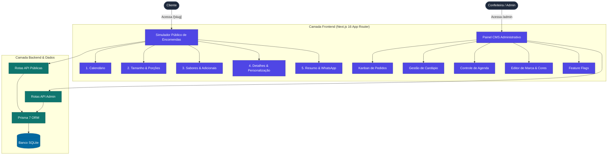

# L'Mere Studio - Simulador de Encomendas & CMS Multi-Tenant para Confeiteiras

[](CHANGELOG.md)
[](https://nextjs.org/)
[](https://react.dev/)
[](https://www.typescriptlang.org/)
[](https://www.prisma.io/)
[](https://tailwindcss.com/)
[](LICENSE)

[English](README.md) | [Português](README.pt-BR.md) | [日本語](README.ja.md) | [Español](README.es.md)

O L'Mere Studio é uma aplicação Web Multi-Tenant White-Label projetada para ateliês de confeitaria e cake designers. O sistema combina um Simulador de Encomendas interativo em 5 etapas para os clientes e um Painel de Administração CMS auto-serviço para os proprietários.

---

## Demonstração

### Simulador Público de Encomendas (Fluxo Mobile)
<video src="./assets/lmere-studio-mobile-demo.mp4" controls="controls" muted="muted" width="100%"></video>

### Painel Administrativo CMS (Fluxo Desktop)
<video src="./assets/lmere-studio-desktop-demo.mp4" controls="controls" muted="muted" width="100%"></video>

## Capturas de Tela

<details>
<summary>Clique para ver a Galeria</summary>
<br>

**Fluxo do Cliente (Mobile)**
| Loja e Calendário | Tamanho e Porções | Sabores e Detalhes |
| :---: | :---: | :---: |
|  |  |  |

**Painel Admin (Desktop)**
| Kanban de Pedidos | Editor de Cardápio | Personalizador de Marca |
| :---: | :---: | :---: |
|  |  |  |

</details>

---

## Funcionalidades Principais

### Simulador Público de Encomendas (`/[slug]`)
- **Etapa 1: Agenda & Calendário**: Seleção interativa de data com validação automática de dias bloqueados e antecedência mínima.
- **Etapa 2: Tamanho & Porções**: Recomendação de peso e fatias (Mini, Pequeno, Médio, Grande) com cálculo de preço base.
- **Etapa 3: Massas, Recheios & Adicionais**: Seleção modular de massas, recheios (únicos/múltiplos), taxa de sabores especiais e itens adicionais (toppers, embalagens).
- **Etapa 4: Detalhes da Personalização**: Mensagem para a placa do bolo, observações do cliente e envio opcional de URL de foto de referência.
- **Etapa 5: Resumo & Finalização**: Detalhamento em tempo real do pedido, cálculo automático de sinal (50%, 100% ou apenas orçamento), cópia de chave PIX em 1 clique e disparo de mensagem formatada diretamente para o WhatsApp do ateliê.

### Painel Administrativo CMS (`/admin`)
- **Gestão de Pedidos**: Acompanhamento de status estilo Kanban (Pendente, Confirmado, Concluído, Cancelado).
- **Gestão de Cardápio**: CRUD completo para tamanhos de bolos, massas, recheios, adicionais e preços.
- **Controle de Agenda**: Bloqueio e desbloqueio de datas específicas e dias de funcionamento.
- **Editor de Marca & Estilo**: Personalização visual em tempo real para logos, banners, paleta de cores (primária, secundária, fundo) e contatos do ateliê.
- **Configuração de Funcionalidades**: Chaves de ativador (Feature Flags) para upload de fotos, opções de entrega e modos de depósito.

---

## Arquitetura do Sistema



---

## Tecnologias Utilizadas

| Domínio | Tecnologia |
| --- | --- |
| Framework | Next.js 16 (App Router, Turbopack) |
| Interface & Estilo | React 19, Tailwind CSS v4, Sistema de Design Glassmorphism |
| Ícones | Lucide React (Padrão Estrito Zero-Emoji) |
| Banco de Dados | Prisma 7 ORM com `@prisma/adapter-better-sqlite3` |
| Segurança | Criptografia Bcrypt para senhas |
| Linguagem | TypeScript 5 (Modo Estrito) |

---

## Instalação e Execução Local

### Pré-requisitos
- Node.js 20.x ou superior
- npm 10.x ou superior

### Passo a Passo

1. Clone o repositório:
   ```bash
   git clone https://github.com/usuario/lmere-studio.git
   cd lmere-studio
   ```

2. Instale as dependências:
   ```bash
   npm install
   ```

3. Configure o arquivo de variáveis de ambiente:
   ```bash
   cp .env.example .env
   ```

4. Execute a criação do banco de dados e o script de seed:
   ```bash
   npx prisma db push --config=prisma.config.ts
   npm run db:seed
   ```

5. Inicie o servidor de desenvolvimento:
   ```bash
   npm run dev
   ```

6. Acesse no navegador:
   - **Simulador Público**: `http://localhost:3000/doce-arte`
   - **Painel CMS Admin**: `http://localhost:3000/admin` (Credenciais: Slug: `doce-arte`, Senha: `admin123`)

---

## Referência das Rotas de API

| Rota | Método | Descrição | Acesso |
| --- | --- | --- | --- |
| `/api/tenants/[slug]` | `GET` | Retorna dados públicos do ateliê, cardápio e agenda | Público |
| `/api/orders` | `POST` | Cria um novo pedido | Público |
| `/api/admin/auth` | `POST` | Autentica a confeiteira no painel admin | Admin |
| `/api/admin/orders` | `GET`, `PATCH` | Lista pedidos e atualiza status | Admin |
| `/api/admin/menu` | `GET`, `POST`, `PUT`, `DELETE` | CRUD de tamanhos, sabores e adicionais | Admin |
| `/api/admin/calendar` | `GET`, `POST`, `DELETE` | Gerencia datas bloqueadas | Admin |
| `/api/admin/settings` | `GET`, `PUT` | Gerencia marca, cores e funcionalidades | Admin |

---

## Licença

Este software está protegido por **Licença Proprietária (Todos os Direitos Reservados)**. O uso comercial, redistribuição, hospedagem como SaaS ou cópia de código sem autorização prévia são estritamente proibidos. Veja o arquivo [LICENSE](LICENSE) para mais detalhes.
