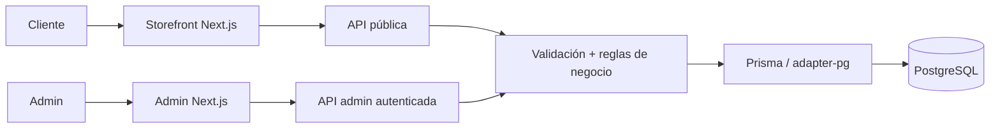

<div align="center">

# L'Mere Studio

**Pedidos multi-tenant con reglas de negocio cuya fuente de verdad es el servidor.**

L'Mere Studio es una aplicación white-label y multi-tenant para pastelerías artesanales y diseñadores de tartas. Combina una tienda pública configurable con un panel administrativo autenticado, manteniendo precios, disponibilidad, pertenencia al tenant y persistencia de pedidos bajo autoridad del servidor.

[English](../../../README.md) · [Português](../pt-BR/README.md) · [日本語](../ja/README.md) · [Español](README.md)

[](https://github.com/Gyliardson/lmere-studio/actions/workflows/quality.yml)
[](../../../LICENSE)

</div>

## Visión general

El flujo público permite que cada tenant exponga su catálogo, agenda, identidad de marca, capacidad, antelación mínima, configuración de depósito y campos personalizados de pedido. El panel autenticado administra esos mismos recursos dentro del ámbito del tenant. Antes de confirmar un pedido o derivarlo a WhatsApp, la API vuelve a validar las decisiones críticas contra los datos persistidos en PostgreSQL.

## ¿Por qué L'Mere Studio?

| Comercio por tenant | Pedido bajo autoridad del servidor | Garantía reproducible |
| --- | --- | --- |
| Catálogo, agenda, identidad de marca, configuración, campos personalizados y operaciones administrativas aislados por tenant. | Catálogo activo, fechas de negocio, capacidad, precios, depósito y pertenencia se resuelven o verifican en el servidor. | Migraciones versionadas, fixtures deterministas en PostgreSQL, pruebas orientadas a riesgo y CI clean-room aportan evidencia acotada de los contratos documentados. |

## Capacidades principales

- flujo público de pedido en cinco pasos en `/<slug-del-tenant>`;
- tamaños, masas, rellenos, extras, agenda, fechas bloqueadas, capacidad, antelación mínima, identidad de marca y contacto configurables por tenant;
- campos personalizados canónicos con un registro histórico del estado del pedido;
- administración autenticada de pedidos, catálogo, calendario, campos personalizados y configuración;
- derivación confirmada a WhatsApp solo después de la validación, el cálculo de precios y la persistencia en el servidor;
- verificación determinista en escritorio y móvil y captura reproducible de material visual para el portafolio.

## Arquitectura



El navegador no es la fuente de verdad para precios persistidos, importe del depósito, disponibilidad, pertenencia al tenant ni autorización entre recursos. Los límites detallados están en [Arquitectura](../../architecture/ARCHITECTURE.md).

## Aspectos técnicos destacados

- **Multi-tenancy.** Los principales recursos relacionales llevan `tenantId`; las rutas administrativas protegidas derivan la identidad del tenant de la sesión verificada, y las mutaciones entre tenants comprueban la pertenencia de los recursos.
- **Precios y disponibilidad bajo autoridad del servidor.** `/api/orders` vuelve a cargar los datos activos del tenant y del catálogo, valida la antelación mínima, las fechas bloqueadas, la agenda semanal, la capacidad diaria, los campos personalizados y los IDs relacionados y, a continuación, calcula el subtotal y el depósito a partir de los valores persistidos.
- **Sesiones administrativas revocables.** Los tokens están firmados con HMAC-SHA256, tienen expiración, se almacenan en una cookie HttpOnly `SameSite=Strict` y se validan contra la generación de sesión persistida del tenant; el cierre de sesión incrementa esa generación.
- **Confirmación transaccional.** La creación de pedidos usa una transacción PostgreSQL con nivel de aislamiento `Serializable`, reintentos acotados para conflictos de escritura y claves de idempotencia en el ámbito del tenant para identificar los reintentos.
- **Historial preservado.** Las selecciones confirmadas, las respuestas de campos personalizados y los valores financieros se guardan en un registro histórico creado por el servidor, en lugar de reconstruirse a partir del estado actual y mutable del catálogo.
- **Verificación determinista.** CI provisiona PostgreSQL 16, aplica las migraciones versionadas, carga fixtures deterministas Tenant A/Tenant B y ejecuta verificaciones estáticas, de base de datos, API, navegador, análisis de seguridad y clean-room.

## Vistas del portafolio

| Resumen de la tienda | Pedidos en administración |
| --- | --- |
|  |  |

| Tienda móvil | Catálogo administrativo móvil |
| --- | --- |
|  |  |

## Inicio rápido

Requisitos: Node.js **22+** y PostgreSQL o un servicio alojado compatible con PostgreSQL.

```bash
git clone https://github.com/Gyliardson/lmere-studio.git
cd lmere-studio
npm ci
cp .env.example .env
npm run db:generate
npm run db:migrate
npm run dev
```

Configura `POSTGRES_PRISMA_URL` y sustituye el placeholder de `ADMIN_SESSION_SECRET` por un valor secreto único antes de ejecutar la aplicación. El seed de demostración es opcional, destructivo y requiere opt-in explícito; revisa [.env.example](../../../.env.example) y la [documentación de calidad](../../assurance/QUALITY.md) antes de usarlo.

## Calidad y garantía

El repositorio separa las verificaciones de comportamiento de la captura de documentación. `npm run quality` cubre lint, comprobación de tipos, pruebas unitarias, validación de Prisma y build de producción; Playwright E2E, integración con PostgreSQL descartable, auditoría de dependencias, escaneo de secretos en todo el historial, CodeQL y verificación clean-room del candidato exacto se ejecutan en GitHub Actions.

Estas verificaciones aportan evidencia de contratos concretos del repositorio. No constituyen una declaración de conformidad WCAG completa, ausencia universal de vulnerabilidades ni aptitud para producción. Consulta [Calidad y pruebas](../../assurance/QUALITY.md) y [Release / clean-room](../../operations/RELEASE.md).

## Documentación

El [hub técnico](../../README.md) organiza la documentación por arquitectura, garantía de calidad, operaciones, versiones en otros idiomas y recursos multimedia.

- [Arquitectura](../../architecture/ARCHITECTURE.md)
- [Calidad y pruebas](../../assurance/QUALITY.md)
- [Release y clean-room](../../operations/RELEASE.md)
- [Medios reproducibles](../../operations/MEDIA.md)

## Limitaciones / fronteras operativas

- Las verificaciones automatizadas de accesibilidad ofrecen cobertura representativa de regresión, no una certificación WCAG completa.
- El material visual generado para el portafolio requiere inspección visual manual antes de publicarse.
- Las URLs HTTPS externas de imágenes pueden exponer metadatos normales de red al host referenciado cuando el navegador las renderiza; la aplicación no obtiene esas URLs desde el servidor.
- La protección de branches y los rulesets son controles de gobernanza externos al modelo de corrección de la aplicación y deben comprobarse de forma independiente cuando la evidencia de release los requiera.
- Un CI satisfactorio demuestra únicamente las verificaciones acotadas implementadas por el repositorio; no demuestra todas las configuraciones de entornos de despliegue o servicios externos.

## Licencia

El código fuente, la arquitectura, los activos de diseño, los esquemas de base de datos y la documentación propiedad de L'Mere son **Proprietary / All Rights Reserved**. Copiar, redistribuir, alojar, modificar o usar comercialmente requiere autorización explícita, salvo cuando las licencias aplicables de terceros otorguen derechos independientes sobre materiales de terceros conservados en el proyecto. Consulta [LICENSE](../../../LICENSE) y [THIRD_PARTY_NOTICES.md](../../../THIRD_PARTY_NOTICES.md).

## Autor

**Gyliardson Keitison** · [GitHub](https://github.com/Gyliardson)
