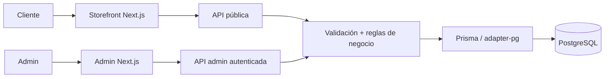

<div align="center">

# L'Mere Studio

**Pedidos multi-tenant con reglas de negocio bajo autoridad del servidor.**

L'Mere Studio es una aplicación white-label y multi-tenant para pastelerías artesanales y diseñadores de tartas. Combina un storefront público configurable con un panel administrativo autenticado, manteniendo precios, disponibilidad, ownership del tenant y persistencia de pedidos bajo autoridad del servidor.

[English](../../../README.md) · [Português](../pt-BR/README.md) · [日本語](../ja/README.md) · [Español](README.md)

[](https://github.com/Gyliardson/lmere-studio/actions/workflows/quality.yml)
[](../../../LICENSE)

</div>

## Visión general

El flujo público expone catálogo, agenda, branding, capacidad, antelación mínima, configuración de depósito y campos personalizados de cada tenant. El panel autenticado administra esos mismos recursos. Antes de confirmar un pedido o preparar el handoff a WhatsApp, la API vuelve a validar las decisiones críticas contra los datos persistidos en PostgreSQL.

## ¿Por qué L'Mere Studio?

| Comercio por tenant | Pedido autoritativo | Garantía reproducible |
| --- | --- | --- |
| Catálogo, agenda, branding, configuración, campos personalizados y operaciones administrativas aislados por tenant. | Catálogo activo, fechas, capacidad, precios, depósito y ownership se resuelven o verifican en el servidor. | Migraciones versionadas, fixtures deterministas en PostgreSQL, pruebas orientadas a riesgo y CI clean-room aportan evidencia acotada de los contratos documentados. |

## Capacidades principales

- flujo público de pedido en cinco pasos en `/<slug-del-tenant>`;
- tamaños, masas, rellenos, extras, agenda, fechas bloqueadas, capacidad, lead time, branding y contacto configurables por tenant;
- campos personalizados canónicos con snapshot histórico del pedido;
- administración autenticada de pedidos, catálogo, calendario, campos personalizados y configuración;
- handoff confirmado a WhatsApp solo después de validación, cálculo y persistencia en el servidor;
- verificación determinista desktop/mobile y captura reproducible de media para portfolio.

## Arquitectura



El navegador no es autoridad para precios persistidos, depósito, disponibilidad, ownership del tenant ni autorización entre recursos. Los límites detallados están en [Arquitectura](../../architecture/ARCHITECTURE.md).

## Aspectos técnicos destacados

- **Multi-tenancy.** Los recursos relacionales principales llevan `tenantId`; las rutas admin protegidas derivan el tenant de la sesión verificada y las mutaciones cross-tenant validan ownership.
- **Precio y disponibilidad en el servidor.** `/api/orders` recarga tenant y catálogo activos, valida lead time, fechas bloqueadas, agenda semanal, capacidad diaria, custom fields e IDs relacionados, y calcula subtotal/deposito con valores persistidos.
- **Sesiones admin revocables.** Los tokens están firmados con HMAC-SHA256, tienen expiración, usan cookie HttpOnly `SameSite=Strict` y se verifican contra la generación de sesión persistida del tenant; logout incrementa esa generación.
- **Confirmación transaccional.** La creación de pedidos usa una transacción PostgreSQL serializable con retry acotado y claves de idempotencia por tenant.
- **Significado histórico preservado.** Selecciones confirmadas, respuestas personalizadas y valores financieros se guardan en un snapshot creado por el servidor.
- **Verificación determinista.** CI provisiona PostgreSQL 16, aplica migraciones, carga fixtures Tenant A/Tenant B y ejecuta gates estáticos, de base de datos, API, navegador, análisis de seguridad y clean-room.

## Vistas del portfolio

| Resumen del storefront | Pedidos en admin |
| --- | --- |
|  |  |

| Storefront mobile | Catálogo admin mobile |
| --- | --- |
|  |  |

## Inicio rápido

Requisitos: Node.js **22+** y PostgreSQL o un servicio alojado compatible.

```bash
git clone https://github.com/Gyliardson/lmere-studio.git
cd lmere-studio
npm ci
cp .env.example .env
npm run db:generate
npm run db:migrate
npm run dev
```

Configura `POSTGRES_PRISMA_URL` y sustituye el placeholder de `ADMIN_SESSION_SECRET` por material secreto único. El seed de demostración opcional es destructivo y requiere opt-in explícito; consulta la [documentación de operaciones](../../README.md#documentation-map) antes de usarlo.

## Calidad y garantía

`npm run quality` cubre lint, typecheck, tests unitarios, validación Prisma y build de producción. Playwright E2E, integración con PostgreSQL descartable, dependency audit, full-history secret scan, CodeQL y verificación clean-room del candidato exacto se ejecutan en GitHub Actions.

Estos gates son evidencia de contratos concretos, no una declaración de conformidad WCAG completa, ausencia universal de vulnerabilidades ni production readiness. Consulta [Calidad y tests](../../assurance/QUALITY.md) y [Release / clean-room](../../operations/RELEASE.md).

## Documentación

El [hub técnico](../../README.md) organiza arquitectura, assurance, operaciones, idiomas y media.

- [Arquitectura](../../architecture/ARCHITECTURE.md)
- [Calidad y tests](../../assurance/QUALITY.md)
- [Release y clean-room](../../operations/RELEASE.md)
- [Media reproducible](../../operations/MEDIA.md)

## Limitaciones / fronteras operativas

- Los checks automatizados de accesibilidad son cobertura de regresión representativa, no certificación WCAG completa.
- La media de portfolio generada requiere inspección visual manual antes de publicarse.
- Las URLs HTTPS externas de imágenes pueden exponer metadatos normales de red al host cuando el navegador las renderiza; la aplicación no obtiene esas URLs desde el servidor.
- La protección de branches y los rulesets son controles de gobernanza externos al modelo de corrección de la aplicación.
- CI demuestra los checks acotados implementados por el repositorio; no demuestra toda configuración de deploy o servicio externo.

## Licencia

El source, la arquitectura, los assets de diseño, los schemas de base de datos y la documentación propios de L'Mere son **Propietarios / Todos los Derechos Reservados**. Copiar, redistribuir, alojar, modificar o usar comercialmente requiere autorización explícita, salvo los derechos independientes que otorguen licencias aplicables a materiales de terceros retenidos. Consulta [LICENSE](../../../LICENSE) y [THIRD_PARTY_NOTICES.md](../../../THIRD_PARTY_NOTICES.md).

## Autor

**Gyliardson Keitison** · [GitHub](https://github.com/Gyliardson)
