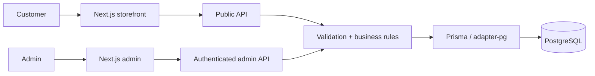

<div align="center">

# L'Mere Studio

**テナント単位の注文体験を、サーバー権威のビジネスルールで支える。**

L'Mere Studio は、洋菓子店やケーキデザイナー向けのホワイトラベル型マルチテナント注文アプリケーションです。設定可能な公開 storefront と認証済み管理画面を組み合わせ、価格、空き状況、テナント所有権、注文永続化の重要な判断をサーバー側で確定します。

[English](../../../README.md) · [Português](../pt-BR/README.md) · [日本語](README.md) · [Español](../es/README.md)

[](https://github.com/Gyliardson/lmere-studio/actions/workflows/quality.yml)
[](../../../LICENSE)

</div>

## 概要

公開フローでは、各テナントが商品、営業日、ブランド、日次容量、最小 lead time、deposit 設定、独自注文項目を提供できます。認証済み admin は同じテナントスコープのリソースを管理します。注文確定や WhatsApp handoff の前に、API が PostgreSQL の永続データを基準として重要なルールを再検証します。

## L'Mere Studio の設計軸

| テナント単位のコマース | サーバー権威の注文確定 | 再現可能な保証 |
| --- | --- | --- |
| 商品、営業日、ブランド、設定、custom field、admin 操作を tenant scope で扱います。 | active catalog、business date、capacity、pricing、deposit、ownership をサーバーで解決または検証します。 | versioned migration、決定的 PostgreSQL fixture、リスク重視テスト、clean-room CI により限定された契約を検証します。 |

## 主な機能

- `/<tenant-slug>` の 5 ステップ公開注文フロー;
- tenant ごとの size、dough、filling、add-on、schedule、blocked date、capacity、lead time、branding、contact 設定;
- 安定 ID を持つ canonical custom field と履歴 order snapshot;
- 注文、商品、calendar、custom field、settings の認証済み admin 管理;
- サーバー検証・価格計算・永続化後にのみ確定する WhatsApp handoff;
- desktop/mobile の決定的ブラウザ検証と再現可能な portfolio capture。

## アーキテクチャ



ブラウザは、永続化される価格、deposit、availability、tenant ownership、cross-resource authorization の権威ではありません。詳細は [Architecture](../../architecture/ARCHITECTURE.md) を参照してください。

## 技術的ハイライト

- **Multi-tenancy.** 主要な relational resource は `tenantId` を持ち、保護された admin route は検証済み session から tenant を導出します。cross-tenant mutation は ownership を検証します。
- **Server-authoritative pricing / availability.** `/api/orders` は active tenant/catalog を再取得し、lead time、blocked date、weekly schedule、daily capacity、custom field、関連 ID を検証して、永続値から subtotal/deposit を計算します。
- **Revocable admin session.** token は HMAC-SHA256 署名、期限付きで、HttpOnly `SameSite=Strict` cookie に保存されます。tenant の永続 session generation と照合され、logout は generation を進めます。
- **Transactional confirmation.** 注文作成は serializable PostgreSQL transaction と限定 retry、tenant-scoped idempotency key を使います。
- **履歴意味の保持.** 確定 selection、custom-field answer、financial value は server-created snapshot に保存されます。
- **Deterministic verification.** CI は PostgreSQL 16、commit 済み migration、Tenant A/B fixture を使い、static/database/API/browser/security-analysis/clean-room gate を実行します。

## ポートフォリオ表示

| Storefront summary | Admin orders |
| --- | --- |
|  |  |

| Mobile storefront | Mobile admin catalog |
| --- | --- |
|  |  |

## クイックスタート

要件: Node.js **22+** と PostgreSQL または PostgreSQL-compatible hosted service。

```bash
git clone https://github.com/Gyliardson/lmere-studio.git
cd lmere-studio
npm ci
cp .env.example .env
npm run db:generate
npm run db:migrate
npm run dev
```

`POSTGRES_PRISMA_URL` を設定し、`ADMIN_SESSION_SECRET` の placeholder を一意な secret material に置き換えてください。任意の demo seed は破壊的で明示 opt-in が必要です。利用前に [operations documentation](../../README.md#documentation-map) を確認してください。

## 品質と保証

`npm run quality` は lint、typecheck、unit test、Prisma validation、production build を実行します。Playwright E2E、disposable PostgreSQL integration、dependency audit、full-history secret scan、CodeQL、exact-candidate clean-room verification は GitHub Actions で実行されます。

これらは限定された repository contract の証拠であり、完全な WCAG 適合、脆弱性ゼロ、production-ready を意味しません。[Quality](../../assurance/QUALITY.md) と [Release / clean-room](../../operations/RELEASE.md) を参照してください。

## ドキュメント

[Technical documentation hub](../../README.md) は architecture、assurance、operations、language、media を整理しています。

- [Architecture](../../architecture/ARCHITECTURE.md)
- [Quality](../../assurance/QUALITY.md)
- [Release / clean-room](../../operations/RELEASE.md)
- [Reproducible media](../../operations/MEDIA.md)

## 制約 / 運用境界

- 自動 accessibility check は代表的な regression coverage であり、完全な WCAG certification ではありません。
- 生成した portfolio media は公開前に manual visual inspection が必要です。
- 外部 HTTPS image URL を browser が表示すると、その host に通常の network metadata が見える可能性があります。application server はその URL を取得しません。
- branch protection / ruleset は application correctness とは別の governance control です。
- CI は repository に実装された限定的な check を証明するもので、すべての deployment/external-service configuration を証明しません。

## ライセンス

L'Mere 所有の source、architecture、design asset、database schema、documentation は **Proprietary / All Rights Reserved** です。保持される third-party material に独自ライセンスが適用される場合を除き、コピー、再配布、hosting、変更、商用利用には明示的な許可が必要です。[LICENSE](../../../LICENSE) と [THIRD_PARTY_NOTICES.md](../../../THIRD_PARTY_NOTICES.md) を参照してください。

## 作者

**Gyliardson Keitison** · [GitHub](https://github.com/Gyliardson)
