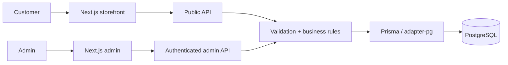

<div align="center">

# L'Mere Studio

**テナントごとの注文体験を、サーバー側を正とするビジネスルールで支える。**

L'Mere Studio は、洋菓子店やケーキデザイナー向けのホワイトラベル型マルチテナント注文アプリケーションです。設定可能な公開ストアフロントと認証済みの管理画面を組み合わせ、価格、空き状況、テナントの所有関係、注文の永続化に関する重要な判断をサーバー側を正として管理します。

[English](../../../README.md) · [Português](../pt-BR/README.md) · [日本語](README.md) · [Español](../es/README.md)

[](https://github.com/Gyliardson/lmere-studio/actions/workflows/quality.yml)
[](../../../LICENSE)

</div>

## 概要

公開フローでは、各テナントが商品カタログ、営業スケジュール、ブランド設定、1 日当たりの受注上限、必要なリードタイム、デポジット設定、注文用カスタム項目を公開できます。認証済みの管理画面では、同じテナントスコープのリソースを管理します。注文を確定したり WhatsApp へ連携したりする前に、API が PostgreSQL に永続化されたデータを基準として重要なルールを再検証します。

## L'Mere Studio の設計軸

| テナント単位のコマース | サーバーを正とする注文処理 | 再現可能な品質保証 |
| --- | --- | --- |
| カタログ、営業スケジュール、ブランド設定、各種設定、カスタム項目、管理操作をテナントごとに分離します。 | 有効なカタログ、営業日、受注上限、価格、デポジット、所有関係をサーバー側で解決または検証します。 | バージョン管理されたマイグレーション、決定的な PostgreSQL フィクスチャ、リスク重視のテスト、clean-room CI により、文書化された契約に対する限定的な検証根拠を提供します。 |

## 主な機能

- `/<tenant-slug>` 配下の 5 ステップ公開注文フロー。
- テナントごとに設定できるサイズ、生地、フィリング、追加オプション、営業スケジュール、休業日、受注上限、リードタイム、ブランド設定、連絡先。
- 正規化されたテナント用カスタム項目と、注文時点の状態を保持する履歴スナップショット。
- 注文、カタログ、カレンダー、カスタム項目、各種設定を扱う認証済み管理画面。
- サーバーでの検証、価格計算、永続化が完了した後にのみ確定する WhatsApp 連携。
- デスクトップ／モバイルの決定的なブラウザ検証と、再現可能なポートフォリオ用メディア取得。

## アーキテクチャ



ブラウザは、永続化される価格、デポジット額、空き状況、テナントの所有関係、リソース間の認可について正とする情報源ではありません。詳細な境界は [Architecture](../../architecture/ARCHITECTURE.md) を参照してください。

## 技術的ハイライト

- **Multi-tenancy.** 主要なリレーショナルリソースは `tenantId` を持ちます。保護された管理ルートは検証済みの管理セッションからテナント識別子を導出し、テナントをまたぐリソース変更では所有関係を検証します。
- **サーバー側を正とする価格・空き状況判定。** `/api/orders` は有効なテナント／カタログデータを再取得し、リードタイム、休業日、週間スケジュール、1 日当たりの受注上限、カスタム項目、関連 ID を検証したうえで、永続化された値から小計とデポジット額を計算します。
- **失効可能な管理セッション。** トークンは HMAC-SHA256 で署名され、有効期限を持ち、HttpOnly `SameSite=Strict` Cookie に保存されます。さらに、テナントに永続化されたセッション世代番号と照合され、ログアウト時にはその世代番号が更新されます。
- **トランザクションによる注文確定。** 注文作成には PostgreSQL の `Serializable` 分離レベルのトランザクションを使用し、書き込み競合には回数制限付きの再試行を行います。再試行を同一処理として識別するため、テナントスコープの冪等性キーを使用します。
- **注文時点の履歴保持。** 確定した選択内容、カスタム項目への回答、金額は、変更可能な現在のカタログから再構築するのではなく、サーバーが作成する履歴スナップショットに保存されます。
- **決定的な検証。** CI は PostgreSQL 16 を用意し、コミット済みのマイグレーションを適用し、決定的な Tenant A/Tenant B フィクスチャを読み込み、静的解析、データベース、API、ブラウザ、セキュリティ分析、clean-room の各検証ゲートを実行します。

## ポートフォリオ表示

### デスクトップのストアフロント

[](../../media/portfolio/desktop-storefront-summary.png)

### デスクトップの管理画面

[](../../media/portfolio/desktop-admin-orders.png)

### モバイルのストアフロントと管理カタログ

<p align="center">
  <a href="../../media/portfolio/mobile-storefront.png"></a>
  <a href="../../media/portfolio/mobile-admin-menu.png"></a>
</p>

## クイックスタート

要件: Node.js **22+** と PostgreSQL、または PostgreSQL 互換のホスティングサービス。

```bash
git clone https://github.com/Gyliardson/lmere-studio.git
cd lmere-studio
npm ci
cp .env.example .env
npm run db:generate
npm run db:migrate
npm run dev
```

`POSTGRES_PRISMA_URL` を設定し、アプリケーションを実行する前に `ADMIN_SESSION_SECRET` のプレースホルダーを一意のシークレット値に置き換えてください。デモ用シードは任意ですが破壊的であり、明示的な opt-in が必要です。使用前に [.env.example](../../../.env.example) と [品質保証ドキュメント](../../assurance/QUALITY.md) を確認してください。

## 品質と保証

リポジトリでは、動作検証とドキュメント用メディア取得を分離しています。`npm run quality` は lint、型チェック、単体テスト、Prisma 検証、本番ビルドを実行します。Playwright E2E、使い捨て PostgreSQL を用いた統合テスト、依存関係監査、全履歴を対象としたシークレットスキャン、CodeQL、正確な候補 SHA に対する clean-room 検証は GitHub Actions で実行されます。

これらの検証は、リポジトリ内の特定の契約に対する限定的な根拠を提供するものです。完全な WCAG 適合、脆弱性が存在しないこと、または本番運用可能性を保証するものではありません。[品質とテストゲート](../../assurance/QUALITY.md) と [リリース／clean-room 検証](../../operations/RELEASE.md) を参照してください。

## ドキュメント

[技術ドキュメント](../../README.md) は、アーキテクチャ、品質保証、運用、各言語版の概要、メディア資産に分けて整理されています。

- [アーキテクチャ境界](../../architecture/ARCHITECTURE.md)
- [品質とテストゲート](../../assurance/QUALITY.md)
- [リリース／clean-room 検証](../../operations/RELEASE.md)
- [再現可能なポートフォリオ用メディア](../../operations/MEDIA.md)

## 制約 / 運用上の境界

- 自動アクセシビリティ検証は代表的な回帰テストの範囲であり、完全な WCAG 認証ではありません。
- 生成したポートフォリオ用メディアは、公開前に手動で目視確認する必要があります。
- 外部 HTTPS 画像 URL をブラウザが表示すると、参照先ホストに通常のネットワークメタデータが伝わる可能性があります。アプリケーションサーバーがその URL を取得することはありません。
- branch protection と ruleset はアプリケーションの正しさとは別のガバナンス制御であり、リリース証跡で必要な場合は独立して確認する必要があります。
- CI の成功が証明するのは、リポジトリに実装された限定的な検証だけです。すべてのデプロイ環境や外部サービス設定を保証するものではありません。

## ライセンス

L'Mere が権利を保有するソースコード、アーキテクチャ、デザイン資産、データベーススキーマ、ドキュメントは **Proprietary / All Rights Reserved** です。保持している第三者素材に適用されるライセンスが独立した権利を認める場合を除き、コピー、再配布、ホスティング、変更、商用利用には明示的な許可が必要です。[LICENSE](../../../LICENSE) と [THIRD_PARTY_NOTICES.md](../../../THIRD_PARTY_NOTICES.md) を参照してください。

## 作者

**Gyliardson Keitison** · [GitHub](https://github.com/Gyliardson)
