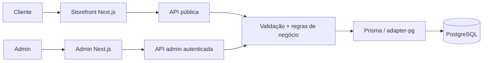

<div align="center">

# L'Mere Studio

**Encomendas multi-tenant com regras de negócio que têm o servidor como fonte de verdade.**

L'Mere Studio é uma aplicação white-label e multi-tenant para ateliês de confeitaria e profissionais de cake design. Ela combina uma loja pública configurável com um painel administrativo autenticado, mantendo preços, disponibilidade, pertencimento ao tenant e persistência de pedidos sob autoridade do servidor.

<a href="../../../README.md">English</a> · <strong>Português</strong> · <a href="../ja/README.md">日本語</a> · <a href="../es/README.md">Español</a>

[](https://github.com/Gyliardson/lmere-studio/actions/workflows/quality.yml)
[](../../../LICENSE)

</div>

## Visão geral

O fluxo público permite que cada tenant exponha seu catálogo, agenda, identidade visual, capacidade, antecedência mínima, configuração de sinal e campos personalizados de pedido. O painel autenticado administra esses mesmos recursos no escopo do tenant. Antes de confirmar um pedido ou encaminhá-lo ao WhatsApp, a API revalida as decisões críticas com base nos dados persistidos no PostgreSQL.

## Por que L'Mere Studio?

| Comércio por tenant | Pedido sob autoridade do servidor | Garantia reproduzível |
| --- | --- | --- |
| Catálogo, agenda, identidade visual, configuração, campos personalizados e operações administrativas isolados por tenant. | Catálogo ativo, datas de negócio, capacidade, preços, sinal e pertencimento são resolvidos ou verificados no servidor. | Migrações versionadas, fixtures determinísticas em PostgreSQL, testes orientados a risco e CI clean-room fornecem evidência delimitada dos contratos documentados. |

## Capacidades principais

- fluxo público de encomenda em cinco etapas em `/<slug-do-tenant>`;
- tamanhos, massas, recheios, adicionais, agenda, datas bloqueadas, capacidade, antecedência mínima, identidade visual e contato configuráveis por tenant;
- campos personalizados canônicos com registro histórico do estado do pedido;
- administração autenticada de pedidos, catálogo, calendário, campos personalizados e configurações;
- encaminhamento confirmado para WhatsApp somente após validação, cálculo de preço e persistência no servidor;
- verificação determinística em desktop e mobile e captura reproduzível de mídia de portfólio.

## Arquitetura



O navegador não é a fonte de verdade para preços persistidos, valor do sinal, disponibilidade, pertencimento ao tenant ou autorização entre recursos. Os limites detalhados estão em [Arquitetura](../../architecture/ARCHITECTURE.md).

## Destaques técnicos

- **Multi-tenancy.** Os principais recursos relacionais carregam `tenantId`; rotas administrativas protegidas derivam a identidade do tenant da sessão verificada, e mutações entre tenants validam o pertencimento dos recursos.
- **Preço e disponibilidade sob autoridade do servidor.** `/api/orders` recarrega os dados ativos do tenant e do catálogo, valida antecedência mínima, datas bloqueadas, agenda semanal, capacidade diária, campos personalizados e IDs relacionados e, em seguida, calcula subtotal e sinal a partir dos valores persistidos.
- **Sessões administrativas revogáveis.** Os tokens são assinados com HMAC-SHA256, têm expiração, ficam em cookie HttpOnly `SameSite=Strict` e são validados contra a geração de sessão persistida do tenant; o logout incrementa essa geração.
- **Confirmação transacional.** A criação de pedidos usa uma transação PostgreSQL com nível de isolamento `Serializable`, retentativas limitadas para conflitos de escrita e chaves de idempotência no escopo do tenant para identificar novas tentativas.
- **Histórico preservado.** Seleções confirmadas, respostas de campos personalizados e valores financeiros são persistidos em um registro histórico criado pelo servidor, em vez de serem reconstruídos a partir do estado atual e mutável do catálogo.
- **Verificação determinística.** O CI provisiona PostgreSQL 16, aplica as migrações versionadas, carrega fixtures determinísticas Tenant A/Tenant B e executa verificações estáticas, de banco de dados, API, navegador, análise de segurança e clean-room.

## Vistas do portfólio

### Loja em desktop

[](../../media/portfolio/desktop-storefront-summary.png)

### Administração em desktop

[](../../media/portfolio/desktop-admin-orders.png)

### Loja e catálogo administrativo em mobile

<p align="center">
  <a href="../../media/portfolio/mobile-storefront.png"></a>
  <a href="../../media/portfolio/mobile-admin-menu.png"></a>
</p>

## Início rápido

Requisitos: Node.js **22+** e PostgreSQL ou um serviço hospedado compatível com PostgreSQL.

```bash
git clone https://github.com/Gyliardson/lmere-studio.git
cd lmere-studio
npm ci
cp .env.example .env
npm run db:generate
npm run db:migrate
npm run dev
```

Configure `POSTGRES_PRISMA_URL` e substitua o placeholder de `ADMIN_SESSION_SECRET` por um valor secreto único antes de executar a aplicação. O seed de demonstração é opcional, destrutivo e exige opt-in explícito; revise o arquivo [.env.example](../../../.env.example) e a [documentação de qualidade](../../assurance/QUALITY.md) antes de usá-lo.

## Qualidade e garantia

O repositório separa as verificações de comportamento da captura de documentação. `npm run quality` cobre lint, verificação de tipos, testes unitários, validação do Prisma e build de produção; Playwright E2E, integração com PostgreSQL descartável, auditoria de dependências, varredura de segredos em todo o histórico, CodeQL e verificação clean-room do candidato exato são executados no GitHub Actions.

Essas verificações fornecem evidência para contratos específicos do repositório. Elas não constituem uma declaração de conformidade WCAG completa, ausência universal de vulnerabilidades ou prontidão para produção. Consulte [Qualidade e testes](../../assurance/QUALITY.md) e [Release / clean-room](../../operations/RELEASE.md).

## Documentação

O [hub técnico](../../README.md) organiza a documentação por arquitetura, garantia de qualidade, operações, idiomas e ativos de mídia.

- [Arquitetura](../../architecture/ARCHITECTURE.md)
- [Qualidade e testes](../../assurance/QUALITY.md)
- [Release e clean-room](../../operations/RELEASE.md)
- [Mídia reproduzível](../../operations/MEDIA.md)

## Limitações / fronteiras operacionais

- As verificações automatizadas de acessibilidade oferecem cobertura representativa de regressão, não certificação WCAG completa.
- A mídia de portfólio gerada exige inspeção visual manual antes da publicação.
- URLs HTTPS externas de imagens podem expor metadados normais de rede ao host referenciado quando o navegador as renderiza; a aplicação não busca essas URLs no servidor.
- Proteção de branch e rulesets são controles de governança externos ao modelo de correção da aplicação e devem ser verificados de forma independente quando a evidência de release exigir.
- Um CI bem-sucedido comprova apenas as verificações delimitadas implementadas pelo repositório; não comprova todas as configurações de ambiente de deploy ou de serviços externos.

## Licença

Código-fonte, arquitetura, ativos de design, esquemas de banco de dados e documentação de propriedade da L'Mere são **Proprietary / All Rights Reserved**. Cópia, redistribuição, hospedagem, modificação ou uso comercial exigem autorização explícita, exceto quando licenças aplicáveis de terceiros concederem direitos independentes sobre materiais de terceiros mantidos no projeto. Consulte [LICENSE](../../../LICENSE) e [THIRD_PARTY_NOTICES.md](../../../THIRD_PARTY_NOTICES.md).

## Autor

**Gyliardson Keitison** · [GitHub](https://github.com/Gyliardson)
