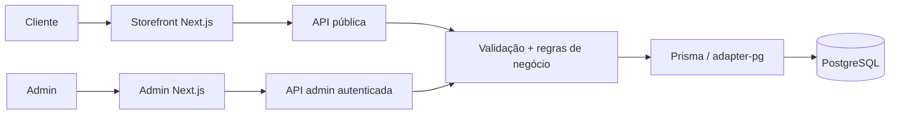

<div align="center">

# L'Mere Studio

**Encomendas multi-tenant com regras de negócio sob autoridade do servidor.**

L'Mere Studio é uma aplicação white-label e multi-tenant para ateliês de confeitaria e cake designers. Ela combina uma loja pública configurável com um painel administrativo autenticado, mantendo preço, disponibilidade, ownership do tenant e persistência de pedidos sob autoridade do servidor.

[English](../../../README.md) · [Português](README.md) · [日本語](../ja/README.md) · [Español](../es/README.md)

[](https://github.com/Gyliardson/lmere-studio/actions/workflows/quality.yml)
[](../../../LICENSE)

</div>

## Visão geral

O fluxo público expõe catálogo, agenda, branding, capacidade, antecedência mínima, configuração de sinal e campos personalizados de cada tenant. O painel autenticado administra esses mesmos recursos. Antes de confirmar um pedido ou preparar o handoff para WhatsApp, a API revalida as decisões críticas contra os dados persistidos no PostgreSQL.

## Por que L'Mere Studio?

| Comércio orientado a tenant | Pedido autoritativo | Garantia reproduzível |
| --- | --- | --- |
| Catálogo, agenda, branding, configuração, campos personalizados e operações administrativas separados por tenant. | Catálogo ativo, datas, capacidade, preço, sinal e ownership são resolvidos ou verificados no servidor. | Migrations versionadas, fixtures determinísticas em PostgreSQL, testes orientados a risco e CI clean-room fornecem evidência delimitada dos contratos documentados. |

## Capacidades principais

- fluxo público de encomenda em cinco etapas em `/<slug-do-tenant>`;
- tamanhos, massas, recheios, adicionais, agenda, datas bloqueadas, capacidade, lead time, branding e contato configuráveis por tenant;
- campos personalizados canônicos com snapshot histórico no pedido;
- administração autenticada de pedidos, catálogo, calendário, campos personalizados e configurações;
- handoff confirmado para WhatsApp somente após validação, cálculo e persistência no servidor;
- verificação determinística desktop/mobile e captura reproduzível de mídia de portfólio.

## Arquitetura



O navegador não é autoridade para preço persistido, sinal, disponibilidade, ownership do tenant ou autorização entre recursos. Os limites detalhados estão em [Arquitetura](../../architecture/ARCHITECTURE.md).

## Destaques técnicos

- **Multi-tenancy.** Os recursos relacionais principais carregam `tenantId`; rotas admin protegidas derivam o tenant da sessão verificada e mutações entre tenants passam por validação de ownership.
- **Preço e disponibilidade no servidor.** `/api/orders` recarrega tenant e catálogo ativos, valida antecedência, datas bloqueadas, agenda semanal, capacidade diária, campos personalizados e IDs relacionados, calculando subtotal e sinal a partir dos valores persistidos.
- **Sessões admin revogáveis.** Tokens são assinados com HMAC-SHA256, têm expiração, usam cookie HttpOnly `SameSite=Strict` e são verificados contra a geração de sessão persistida do tenant; logout avança essa geração.
- **Confirmação transacional.** A criação de pedidos usa transação PostgreSQL serializável, retry limitado para conflitos e chaves de idempotência por tenant.
- **Histórico preservado.** Seleções confirmadas, respostas personalizadas e valores financeiros são gravados em snapshot criado pelo servidor.
- **Verificação determinística.** O CI provisiona PostgreSQL 16, aplica migrations, carrega fixtures Tenant A/Tenant B e executa gates estáticos, de banco, API, navegador, análise de segurança e clean-room.

## Vistas do portfólio

| Resumo da loja | Pedidos no admin |
| --- | --- |
|  |  |

| Loja mobile | Catálogo admin mobile |
| --- | --- |
|  |  |

## Início rápido

Requisitos: Node.js **22+** e PostgreSQL ou serviço hospedado compatível.

```bash
git clone https://github.com/Gyliardson/lmere-studio.git
cd lmere-studio
npm ci
cp .env.example .env
npm run db:generate
npm run db:migrate
npm run dev
```

Configure `POSTGRES_PRISMA_URL` e substitua o placeholder de `ADMIN_SESSION_SECRET` por material secreto único. O seed de demonstração opcional é destrutivo e exige opt-in explícito; consulte a [documentação de operações](../../README.md#documentation-map) antes de usá-lo.

## Qualidade e garantia

`npm run quality` cobre lint, typecheck, testes unitários, validação Prisma e build de produção. Playwright E2E, integração com PostgreSQL descartável, audit de dependências, secret scan do histórico, CodeQL e verificação clean-room por candidato exato rodam no GitHub Actions.

Esses gates são evidência de contratos específicos, não uma declaração de conformidade WCAG completa, ausência universal de vulnerabilidades ou prontidão de produção. Consulte [Qualidade e testes](../../assurance/QUALITY.md) e [Release / clean-room](../../operations/RELEASE.md).

## Documentação

O [hub técnico](../../README.md) organiza arquitetura, garantia, operações, idiomas e mídia.

- [Arquitetura](../../architecture/ARCHITECTURE.md)
- [Qualidade e testes](../../assurance/QUALITY.md)
- [Release e clean-room](../../operations/RELEASE.md)
- [Mídia reproduzível](../../operations/MEDIA.md)

## Limitações / fronteiras operacionais

- Os checks automatizados de acessibilidade são cobertura de regressão representativa, não certificação WCAG completa.
- Mídia de portfólio gerada exige inspeção visual manual antes da publicação.
- URLs HTTPS externas de imagem podem expor metadados normais de rede ao host quando o navegador as renderiza; a aplicação não busca essas URLs no servidor.
- Proteção de branch e rulesets são controles de governança externos ao modelo de correção da aplicação.
- CI prova apenas os checks delimitados implementados pelo repositório; não prova toda configuração de deploy ou serviço externo.

## Licença

Fonte, arquitetura, assets de design, schemas de banco e documentação próprios da L'Mere são **Proprietários / Todos os Direitos Reservados**. Cópia, redistribuição, hospedagem, modificação ou uso comercial exigem autorização explícita, exceto quando licenças de terceiros concederem direitos independentes sobre materiais de terceiros retidos. Consulte [LICENSE](../../../LICENSE) e [THIRD_PARTY_NOTICES.md](../../../THIRD_PARTY_NOTICES.md).

## Autor

**Gyliardson Keitison** · [GitHub](https://github.com/Gyliardson)
